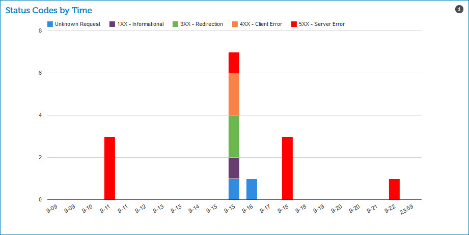

# Status Codes by Time gadget 

<head>
  <meta name="guidename" content="Integration"/>
  <meta name="context" content="GUID-f7ffb795-94eb-4a10-af16-629fc35d52b5"/>
</head>

The Status Codes by Time gadget on the HTTP Status Dashboard page shows a bar chart of the number of status code messages that occurred on a daily, hourly, or date range.

The color codes are:

-   Blue — unknown requests

-   Purple — 1XX Informational codes

-   Green — 3XX Redirection codes that indicate additional action is required to complete the request

-   Orange — 4XX Client Error codes

-   Red — 5XX Server Error codes where the server failed to fulfill an apparently valid request

The number of status messages by type display when you pause on a color.