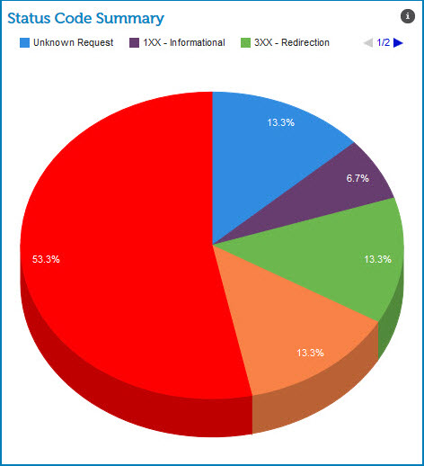

# Status Code Summary gadget 

<head>
  <meta name="guidename" content="Integration"/>
  <meta name="context" content="GUID-ec03102b-6037-4f6c-a28a-a05117afdca2"/>
</head>

The Status Code Summary gadget on the HTTP Status Dashboard shows the percentage of communication messages by status code type that occurred within the time frame you designated.

The status types color codes are:

-   Blue — unknown requests

-   Purple — 1XX Informational codes

-   Green — 3XX Redirection codes that indicate additional action is required to complete the request

-   Orange — 4XX Client Error codes

-   Red — 5XX Server Error codes where the server failed to fulfill an apparently valid request

The percentage that each message occurred within the designated time frame appears in the pie chart section and by pausing the cursor over a slice.