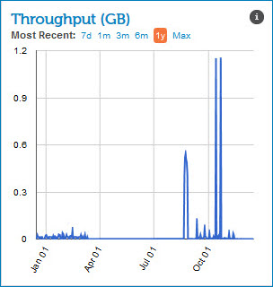

# Throughput gadget 

<head>
  <meta name="guidename" content="Integration"/>
  <meta name="context" content="GUID-929a4a1e-c00f-4807-bc7a-fd5b4f47e36f"/>
</head>

The Throughput gadget on the Account Dashboard page shows the total volume of data processed across an account or across all accounts in a particular account group.

The overall throughput size is calculated by the average of the total size of inbound documents and total size of outbound documents. Throughput = \(\(document size inbound + document size outbound\) / 2\).

All graphical data is not real-time data, but is rather a representation of aggregated data referenced in the two to three previous days. These graphs are meant to serve as an historical snapshot of the account \(or account group\) data.