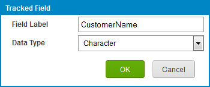

# Tracked Field dialog 

<head>
  <meta name="guidename" content="Integration"/>
  <meta name="context" content="GUID-a8069e7c-333b-4e62-9439-610ea1a38111"/>
</head>

This dialog opens when you click the **Add Tracked Field** icon or select a tracked field and click the **Edit Tracked Field** icon on the Tracked Fields page.

**Name**  
**Description**

**Field Label**  
Name of the tracked field that appears in connector operations and document fields on the Process Reporting page.

**Data Type**  
Format of the dynamic data displayed in the document fields on the Process Reporting page.