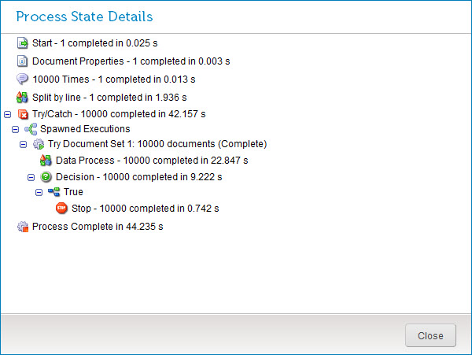

# Process State Details dialog 

<head>
  <meta name="guidename" content="Integration"/>
  <meta name="context" content="GUID-5c94e8b7-9cb3-4b26-8bc6-f2917f9f5d13"/>
</head>

View process state details, such as type, count, and time elapsed.

In the **Manage** menu’s **Process Reporting** page, select ** View Process State** in either of the following menus to open the Process State Details dialog:

-   ** Actions** menu for a process execution in execution search results

-   ** Actions** menu in an execution detail view

**Note:** The View Process State action is not available for test mode executions.

## Steps list 

For each executed step, the following logged data is shown:

-   Type or, if applicable, custom label

-   Count of either the number of times the step was performed or the number of documents processed, depending on the step type

-   Time elapsed in seconds \(“s”\), with precision to the millisecond

The last entry in the list is the total process execution time in seconds \(“s”\), with precision to the millisecond.

## Close 

Clicking this button closes the dialog.