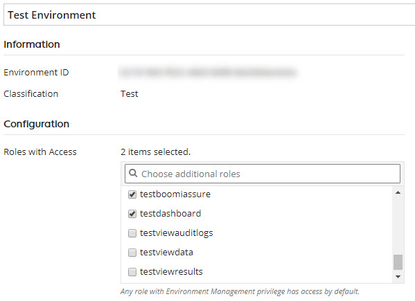

# Attaching a role to or detaching a role from an environment 

<head>
  <meta name="guidename" content="Integration"/>
  <meta name="context" content="GUID-ba0f57ad-61f6-4b99-b554-0c5b58e9dafe"/>
</head>

Use the **Manage** \> **Atom Management** \> **Environments** page to attach or detach a role to an environment.

## Before you begin

You must have the Atom Management and Environment Management privileges to perform this task. If you have the Atom Management Read Access privilege, you cannot perform the task.

## About this task

1.  Go to **Manage** \> **Atom Management**.

2.  In the Environments list on the left, click the Environment's name.

    The Environment Properties page opens.

3.  In the **Roles with Access** list, turn on the check boxes for those roles you wish to attach to the selected environment.

4.  To detach a role, turn off the check boxes in the **Roles with Access** list for those roles you do no longer want to attach to the environment.