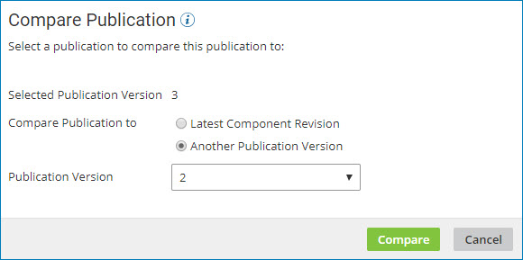

# Comparing two publication versions 

<head>
  <meta name="guidename" content="Integration"/>
  <meta name="context" content="GUID-095943b8-6fad-409a-859c-719bfa4acd03"/>
</head>

You can compare two publication versions to identify which components were modified, added, or removed between publications.

## About this task

For Legacy deployment, a publication can include API Service components. The UI for comparing publication versions under Legacy deployment varies slightly from this task.

## Procedure

1.  In the **Process Library** page, highlight a component in the **Packaged Processes** list \(without turning on its check box\).

    The **Publication History** table is displayed.

2.  Click **Actions** for the version that you want to compare and select **Compare Publication**.

    The **Compare Publication** wizard opens with the selected version in the **Selected Publication Version** field.

3.  In the **Compare Publication to** field do one of the following:

    -   Select **Latest Revision in Development**.

    -   Select **Another Publication Version** and select a version number from the drop-down list.

        

4.  Click **Compare**.

    The comparison results are displayed. Differences between the two publications are highlighted.

5.  To contact the user who last modified a specific component within either version of the publication, copy the email address in the **Modified By** field into a new email.

6.  To select a different version with which to compare, click **Back** and repeat steps 3 and 4.

7.  When you are done comparing the two publications, click **Close**.