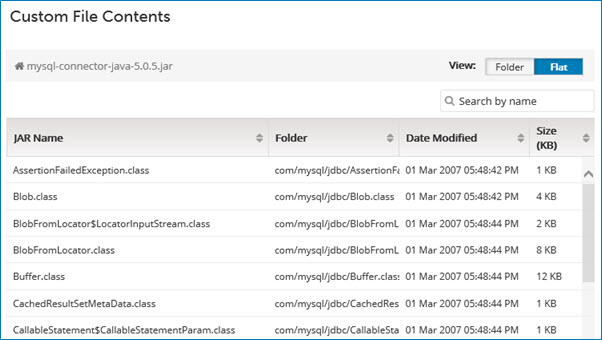

# Displaying the contents of a custom file 

<head>
  <meta name="guidename" content="Integration"/>
  <meta name="context" content="GUID-827173ef-1974-4280-8dd7-4aeb7cda9f83"/>
</head>

You can display the contents of a custom JAR file that you uploaded.

## About this task

JAR files typically contain Java class files and related resources.

## Procedure

1.  On the **Manage Account Libraries** page, select the JAR file whose contents you want to display.

2.  In the ** Actions** menu for the file, select **View Contents**.

    The **Custom File Contents** panel is displayed.

    

    You can switch between the following views:

    -   Folder view groups the files by folder. The Name column can contain either a file name or a folder name.

    -   Flat view shows all files in a single, combined list. The Folder column indicates where each file resides.

    You can sort the list by file name, folder name, date modified, or size.

    You can search for files by typing in the **Search by name** field. As you type, the list is filtered to include only files whose names match the typed characters partially or completely. Pressing **Esc** or clicking  clears the field and stops filtering.