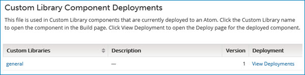

# Displaying deployments that reference a custom file 

<head>
  <meta name="guidename" content="Integration"/>
  <meta name="context" content="GUID-f22d9361-1f5f-431e-ab2b-29e2622ebedb"/>
</head>

You can display a list of Custom Library deployments that reference a given custom JAR file.

1.  On the **Manage Account Libraries** page, select the JAR file whose deployments you want to display.

2.  In the ** Actions** menu for the file, select **View Deployments**.

    The **Custom Library Component Deployments** panel is displayed. Custom Library components that reference the JAR file and which are currently deployed appear in alphabetical order by name.

    

3.  Click a Custom Library component name to open that component in the Build page.

4.  Click **View Deployment** for a Custom Library component to view the deployment that contains the selected JAR file.

    The Deployments page is displayed.

    :::info
    
    For Legacy deployment, the Deploy page is displayed.

    :::