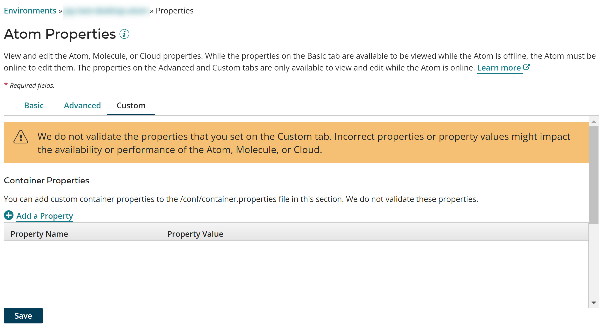

# Invoking the concurrent garbage collector 

<head>
  <meta name="guidename" content="Integration"/>
  <meta name="context" content="GUID-44251e0e-a171-49f5-8e37-cf4c9a911236"/>
</head>


If you are running Java 8 and you use 4GB of memory or more on your Atom, Molecule, or Atom Cloud, recommends invoking the concurrent garbage collector.

## About this task

The default garbage collector for Java 8 is the Parallel Collector. The default garbage collector for Java 11 is G1.

1.  Go to **Manage** \> **Atom Management**.

2.  Click the **Custom** tab.

    

3.  In the **System Properties** section, click ** Add a Property**.

4.  In the **Property** field, type a garbage collector setting that is appropriate for your version of Java.

    Here are some examples of Java 8 garbage collector settings:

    ```
    -XX:+UseConcMarkSweepGC
    -XX:CMSInitiatingOccupancyFraction=50
    -XX:-UseGCOverheadLimit
    ```

    For details about garbage collector settings, see [Java VM Garbage Collection Tuning](http://docs.oracle.com/javase/8/docs/technotes/guides/vm/gctuning/index.html) and [Java VM Options \(Windows\)](https://docs.oracle.com/javase/8/docs/technotes/tools/windows/java.html#BABFAFAE) or [Java VM Options \(Linux\)](https://docs.oracle.com/javase/8/docs/technotes/tools/unix/java.html#BABFAFAE).

5.  For each additional garbage collector setting, repeat steps 3–4.

6.  Click **Save**.

    Because changes to these properties do not take effect until the Atom, Molecule, or private Atom Cloud is restarted, you are prompted to restart. You have the option to restart now or restart later.

    Only Atom, Molecule, and Atom Cloud owners can restart them. Accounts that have an Atom in an Atom Cloud cannot restart the Cloud.