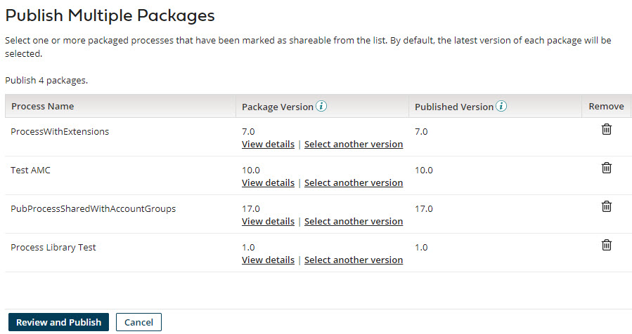
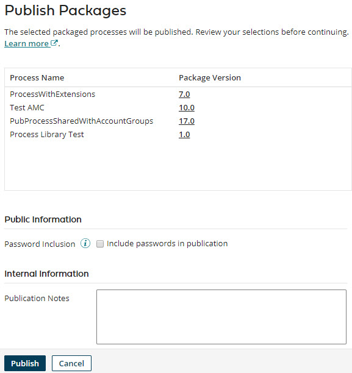

# Publishing multiple processes 

<head>
  <meta name="guidename" content="Integration"/>
  <meta name="context" content="GUID-944c17d1-f617-4d72-af3d-39513f9aff41"/>
</head>

Publish multiple processes to make them available for installation into managed accounts.

## Before you begin

Before you can publish a process or component, you must first create a packaged component version of it and mark it shareable.

## About this task

After you have tested packaged processes and found them to be suitable for installation into managed accounts, the next step toward making the processes available is to publish them.

:::note

For Legacy deployment, API Service components must also be published in order to be included in an integration pack.

:::

## Procedure

1.  On the **Process Library** page in the **Packaged Processes** list, do one of the following to locate shareable packaged processes:

    -   Click the **Add Filter** and select one of the preset filters.

    -   If the processes have similar names, type part of the name in the search box.

2.  Do one of the following:

    -   If you want to publish all of the shareable packaged processes that are displayed, select the check box of the top-most folder. All processes are selected.

    -   If you want to publish all shareable packaged processes within a folder, select the folder's check box.

    -   Select the check boxes next to individual packaged processes that you want to publish.

    The **Publish Multiple Packages** table appears with the processes listed in the order they were selected.

    

3. **Optional:**  To display information about a package version, click **View Details**.

    The **Package Details** page is displayed.

4. **Optional:** To select a different version of a package to publish, click **Select another version**.

    The **Select Package Version** page is displayed.

5. **Optional:** To remove any packages that you do not want to publish, do one of the following:

    -   Clear the check box in the **Packaged Processes** list.

    -   Click **Remove** to delete the row.

6.  Click **Review and Publish**.

    The **Publish Packages** dialog opens.

    

7. **Optional:** To display detailed information about a package version, click the version ID in the **Package Version** field.

    The **Package Details** page is displayed.

8. **Optional:** If you want to include passwords, select **Include passwords in process publication**.

    Any passwords that are specified within the processes are included in the publication.

9. **Optional:**  In the **Publication Notes** field, type internal notes describing the collective changes for the new publications.

10. Click **Publish**.

    The selected processes are published.

After processes are published they must be shared in order to become available for installation in managed accounts. Sharing means adding the processes as resources to account groups of which managed accounts are members — you do this in the Setup page on the **Account Groups** tab.