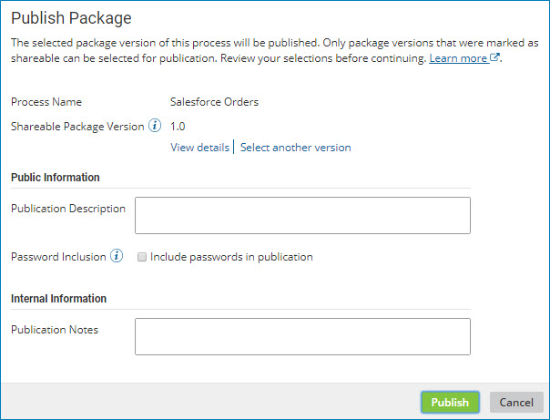

# Publishing one process 

<head>
  <meta name="guidename" content="Integration"/>
  <meta name="context" content="GUID-8f615b9e-6cfb-4ad0-ab61-3bb868495a07"/>
</head>

Publish a process to make it available for installation into managed accounts.

## Before you begin

Before you can publish any process or component, you must create a "packaged component" version of it and mark it shareable.

## About this task

After you have tested a packaged process and found it to be suitable for installation into managed accounts, the next step toward making the process available is to publish it.

:::note

For Legacy deployment, API Service components must also be published in order to be included in an integration pack.

:::

## Procedure

1.  On the **Process Library** page in the **Packaged Processes** list, do one of the following to locate a shareable packaged process:

    -   Click the **Add Filter** button  nnd select a preset filter.

    -   Type all or part of the process name in the search box.

2.  Select the process so that it is highlighted but do not select its check box.

3.  Click **Publish Package**.

    The Publish Package dialog opens.

    

4. **Optional:**   To display information about the selected package version, click **View Details**.

    The Package Details page is displayed.

5. **Optional:**   To select a different version of the package to publish, click **Select another version**.

    The Select Package Version page is displayed.

6. **Optional:**   In the **Publication Description** field, type a description of the publication.

    This description appears in the Browse Process Library dialog where users select published processes to install.

7. **Optional:**  If you want to include passwords, select **Include passwords in publication**.

    Any passwords that are specified within the process are included in the publication.

8. **Optional:**  In the **Publication Notes** field, type internal notes describing the changes for the new publication.

9.  Click **Publish**.

    The newly published version appears in the Publication History table.

## Next steps

After a process is published it must be shared in order to become available for installation in managed accounts. Sharing means adding the process as a resource to account groups of which managed accounts are members — you do this in the Setup page on the **Account Groups** tab.