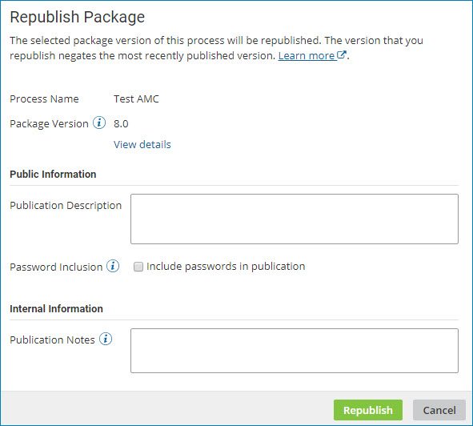

# Republishing a publication version 

<head>
  <meta name="guidename" content="Integration"/>
  <meta name="context" content="GUID-702dd301-7d76-40da-93f7-eb6453ac9e43"/>
</head>

Publish an older version of a process for use by managed accounts.

## About this task

You can effectively "roll back" a published version that has problems. You cannot delete a published version of a process; you can negate a published version only by publishing a new version or republishing a previous version.

:::note

Republishing a previous version *does not* roll back the current process configuration as you see it on the Build page. You must perform this step on the Build page through the process revision history.

:::

:::note

For Legacy deployment, API Service components can also be published and republished. The interface for republishing a publication version under Legacy deployment varies slightly from this task.

:::

## Procedure

1.  In the **Process Library** page, highlight the process in the **Packaged Processes** list \(but do not turn on its check box\).

    The **Publication History** table is displayed.

2.  Click **Actions** for the version that you want to republish and select **Republish**. Note that the Republish option is only available for older versions of your published packages— the newest published version will not have this option.

    The **Republish Package** dialog opens.

    

3. **Optional:**  To display information about the selected package version, click **View Details**.

    The **Package Details** page is displayed.

4. **Optional:** In the **Publication Description** field, type a description of the publication.

5. **Optional:** If you want to include passwords, select **Include passwords in publication**.

    Any passwords that are specified within the process are included in the publication.

6. **Optional:** In the **Publication Notes** field, type internal notes describing the reason for republishing.

7.  Click **Republish**.

    A newly published version appears in the **Publication History** table. The new version is identical to the version you selected in step 2; the new version negates the most recently published version. For example, if version 5 is the most recently published version and you republish version 4, a new version 6 will be published with the same process revisions as were in version 4.

    In the Publication Notes column for the new version, the following appear, in order:

    1.  the reason for republishing that you typed in the **Publication Notes** field, if any

    2.  publication notes for the source version, if any