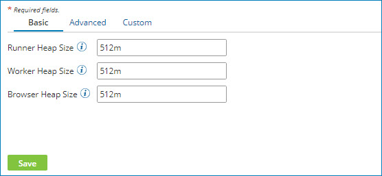
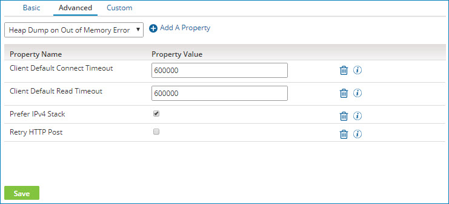
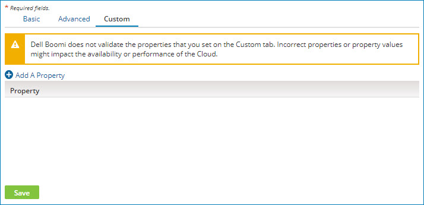

# Setting forked execution properties for a Molecule or Atom Cloud 

<head>
  <meta name="guidename" content="Integration"/>
  <meta name="context" content="GUID-a100d6a2-88eb-4fab-bc4d-9772aca9dcc1"/>
</head>

If your account owns a local Molecule or private Atom Cloud, you can set properties on the Forked Execution Properties panel that affect how forked executions run.

## Before you begin

You must have the Atom Management privilege to set properties. If you have the Atom Management Read Access privilege, you can view existing settings, but you cannot change them.

## About this task

Forked execution properties are stored in your \<installation\_directory\> in one or more of the following files:

-   /bin/procrunner.vmoptions

-   /bin/procworker.vmoptions

-   /bin/procbrowser.vmoptions

:::note

Properties that you set on the Forked Execution Properties panel do *not* affect any customized Molecule or Atom Cloud script files that you might have created previously \(such as procrunner.ps1, procworker.ps1, or procbrowser.ps1\). If you continue to use those customized scripts, you must update them manually.

:::

## Procedure

1.  Go to **Manage** \> **Atom Management**.

2.  Select the Molecule or private Atom Cloud from the list.

3.  In Settings & Configuration, click **Forked Execution Properties**.

    **Note:** The properties that you see are those that were in effect when the Molecule or private Atom Cloud started. Properties are displayed regardless of how they were set — through the user interface or manually by editing the procrunner.vmoptions, procworker.vmoptions, or procbrowser.vmoptions file.

4.  To set a property value on the Basic tab, use the field next to the property name.

    

    Each Heap Size property is stored in the appropriate vmoptions file—procrunner, procworker, or procbrowser.

5.  To set a property value on the Advanced tab:

    1.  Click the **Advanced** tab.

        

    2.  Select a property from the list and click ** Add a Property**.

    3.  Enter a value in the **Property Value** field next to the property name.

    Some errors can be detected immediately. A red box appears around the property if there are errors. The error messages appear below the box.

    These properties are stored in all three vmoptions files—procrunner, procworker, and procbrowser.

6.  To set a custom property on the Custom tab:

    1.  Click the **Custom** tab.

        

    2.  Click ** Add a Property**.

    3.  Type the property in the **Property** field.

        You must enter the complete property. For example, `-Djava.property` or `-Dcom.property`.

        Any custom properties that you set are stored in all three vmoptions files—procrunner, procworker, and procbrowser.

7.  **Optional:** To delete a property from the Advanced or Custom tab, click **Remove ** next to the property.

8.  Click **Save**.

    If errors are still detected, a warning message appears containing the names of the tab\(s\) on which there are errors. You must correct the errors before the properties can be saved.

    Most of the properties that you set take effect with the next forked execution. The exception is Atom worker properties. Because Atom workers remain active until their Time To Live expires, properties in the /bin/procworker.vmoptions file take effect the next time an Atom worker is started. If you want those properties to take effect immediately, you can stop and restart an Atom worker.