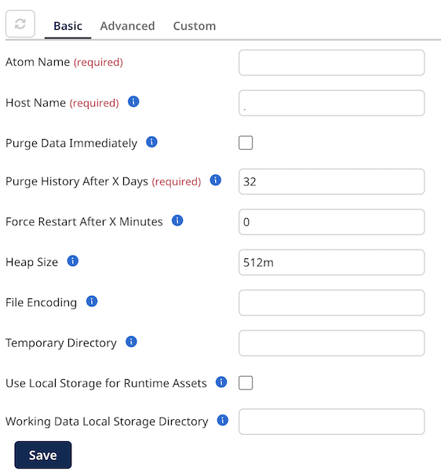
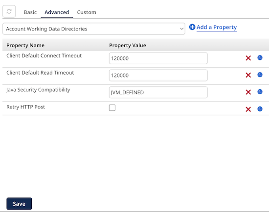

# Setting or viewing Atom, Molecule, Cloud, or Account properties 

<head>
  <meta name="guidename" content="Integration"/>
  <meta name="context" content="GUID-74a45065-dc5f-4c15-8dcb-d1aa1273689b"/>
</head>

The capability and steps to set Atom, Molecule, Cloud, or Account properties vary depending on your account type and privileges.

## Before you begin

You must have the Atom Management privilege to set properties. If you have the Atom Management Read Access privilege, you can view existing settings, but you cannot change them.

## About this task

If your account owns a local Atom, Molecule or private Atom Cloud, you can set its properties on the Atom, Molecule, or Cloud Properties panel.

If your account owns a private Atom Cloud, the owner can set the Cloud’s properties and its accounts’ properties in the Account Properties panel. An individual account that owns an Atom in a Cloud can set only its own account properties in the Account Properties panel.

Cloud owners and accounts that have an Atom attached to the Cloud can use the Cloud Attachment Quotas tab to view the account’s properties and property values in the Cloud.

## Procedure

1.  Go to **Manage** \> **Atom Management**.

2.  Do one of the following:

    -   If you are the owner of a local Atom, Molecule, or private Atom Cloud, select your Atom, Molecule, or Cloud from the list on the left.

    -   If you are an account owner, select your Atom from the list on the left.

3.  Do one of the following:

    -   Open the **Properties** panel.

    -   Open the **Account Properties** panel.

    :::note
    
    The properties that you see are those that were in effect when the Atom, Molecule, or private Atom Cloud started. Properties are displayed regardless of how they were set — through the UI or manually by editing the \<installation\_directory\>/conf/container.properties file or the \<installation\_directory\>/bin/atom.vmoptions file.

    :::

4.  To set a property value on the Basic tab, use the field or check box next to the property name.

    

5.  To set a property value on the Advanced tab:

    1.  Click the **Advanced** tab.

        

    2.  Select a property from the list and click ** Add a Property**.

    3.  Enter a value in the **Property Value** field next to the property name.

    Some errors can be detected immediately. A red box appears around the property if there are errors. The error messages appear below the box.

    Properties initially appear in the order in which you add them. After you click Save, the properties are alphabetized by property name.

6.  To set a property value on the Custom tab, click the **Custom** tab.

    Only owners of local Atoms, Molecules, and private Atom Clouds have access to this tab. If you own an Atom set up in a private Cloud, you cannot see the Custom tab.

    Some errors can be detected immediately. A red box appears around the property if there are errors. The error messages appear below the box.

    Properties initially appear in the order in which you added them. After you click Save, the properties are alphabetized by property name.

    

7.  To set a custom container property on the Custom tab:

    1.  Click ** Add a Property** in the **Container Properties** section.

    2.  Type the property name in the **Property Name** field.

        You must enter the complete property name. For example, `com.boomi.container.property`.

    3.  Enter a value in the **Property Value** field next to the property name.

8.  To set a custom system property on the Custom tab:

    1.  Click ** Add a Property** in the **System Properties** section.

    2.  Type the property in the **Property** field.

        You must enter the complete property. For example, `-Djava.property` or `-Dcom.property`.

9.  **Optional:** To delete a property from the Advanced or Custom tab, click **Remove ** next to the property.

10. **Optional:** To view an account’s properties and property values in the Cloud, in the Account Properties dialog click the **Cloud Attachment Quotas** tab.

11. Click **Save**.

    Because changes to many of these properties do not take effect until the Atom, Molecule, or private Atom Cloud is restarted, you are prompted to restart. You have the option to restart now or restart later.

    Only Atom, Molecule, and Cloud owners can restart them. Accounts that have an Atom in a Cloud cannot restart the Cloud.

    If errors are still detected, a warning message appears containing the names of the tab\(s\) on which there are errors. You must correct the errors before the properties can be saved.