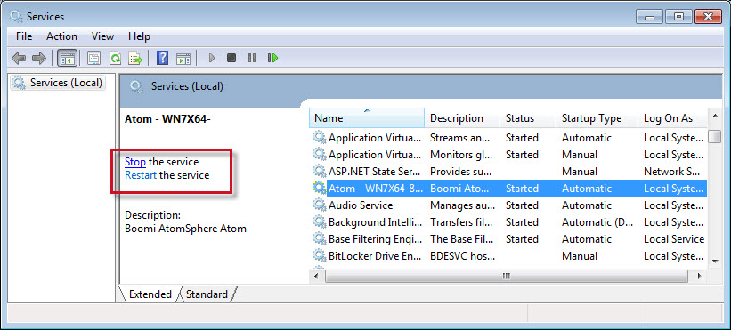
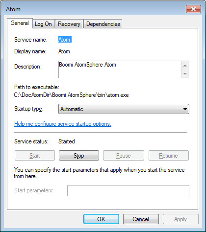

# Starting, stopping, or configuring an Atom running as a service 

<head>
  <meta name="guidename" content="Integration"/>
  <meta name="context" content="GUID-52f3d5cc-fd42-46a5-9adf-c5ebd6f04d50"/>
</head>

Follow this guidance to start, stop, or configure Atoms, Molecule nodes, and Cloud Molecules.

## Procedure

1.  Go to **Control Panel** \> **Administrative Tools** \> **Services**.

2.  In the Services window locate your Atom, Molecule node, or Cloud Molecule in the **Name** column and click it to select it.

    Its status appears in the Status column.

3.  Do one of the following:

    -   If it is started, stop it by clicking the **Stop** link to the left.

    -   If it is started, restart it by clicking the **Restart** link.

    -   If it is not running, start it by clicking the **Start** link.

    

4. **Optional:** To configure the Atom, Molecule node, or Cloud Molecule's service properties, right-click in the list and select **Properties**.

    This dialog opens:

    

5. **Optional:** Change the service's properties as needed and then click **OK**.