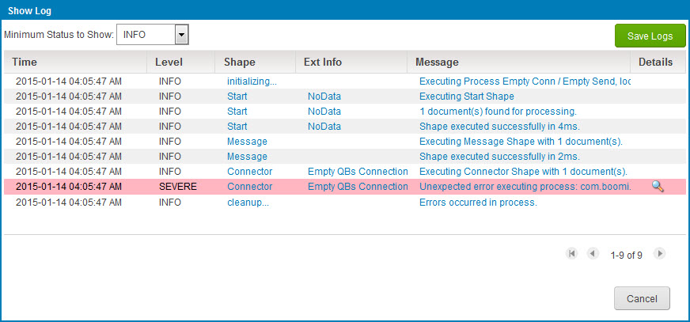

# Viewing a document log 

<head>
  <meta name="guidename" content="Integration"/>
  <meta name="context" content="GUID-d5679021-527b-4d11-a12e-1132830a592f"/>
</head>

You can view time, messages, and other information in document logs.

## About this task

For enhanced performance, executions that retrieve 50 or more inbound documents will provide document logs only for documents that had errors.

## Procedure

1.  Select **Manage** \> **Process Reporting**.

2.  Do one of the following:

    -   In process execution search results, find the execution in which the document was processed and then click the execution’s date/time link to go to its detail view. In the ** Actions** menu for the document, either:

        -   Select ** View Logs**, or

        -   Select **View Linked Documents**. In the View Linked Documents dialog’s ** Actions** menu for the document in question, select ** View Logs**.

    -   In document search results, find the document and then click the date/time link. In the Document Details ** Actions** menu select ** View Logs**.

    The Show Log dialog opens and the connects to the Atom and retrieves the log's contents. Once retrieved, the logged events are shown in the dialog.

    

3. **Optional:** To download the contents of the log, click **Save Logs**.

    Depending on your browser and its download settings, you may be prompted to specify the destination path and filename. The default filename is process\_log.zip.

4.  To return to the view or dialog from which you entered the Show Log dialog, click **Cancel**.

## Results

:::note

The recommended technique for troubleshooting documents with errors is to navigate to the Error Document detail view in Process Reporting. There you can view error detail, including the stack trace, in an easy-to- read format. You can also access the Boomi Resolve database for possible solutions. See the topics about document error details and Boomi Resolve.

:::