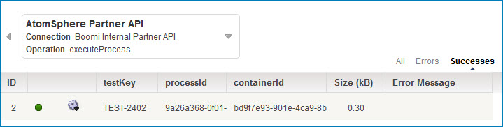

# Viewing a document’s tracked fields in a process execution 

<head>
  <meta name="guidename" content="Integration"/>
  <meta name="context" content="GUID-993ecd43-3b3d-416d-a5eb-7670e54376f7"/>
</head>

After you have deployed the version of the process that includes the tracked fields, you can view the tracked fields' values on the Manage menu's Process Reporting page.

# About this task

Tracked field values display only after you deploy a process with tracked fields. The Boomi Enterprise Platform does not retroactively find document values from previous process executions.

## Procedure

1.  Go to the **Manage** menu's **Process Reporting** page.

2.  In the **Executions** list click the **Past Hour** drop-down arrow, select the time frame in which the process was executed and click **Apply**.

3.  Select an execution record and click the execution’s date/time link in the results table.

    The execution detail view opens.

4.  Locate the box that displays the connection, and click the **Successes** or **Errors** link.

    The field label for the tracked field appears as a column label in the table. In the example below, the testKey, processID and containerID columns display tracked fields.

    The tracked field data appears in the new column for each operation containing a tracked value. A tracked field’s value is limited to 1000 characters, which you can see in this column.

    