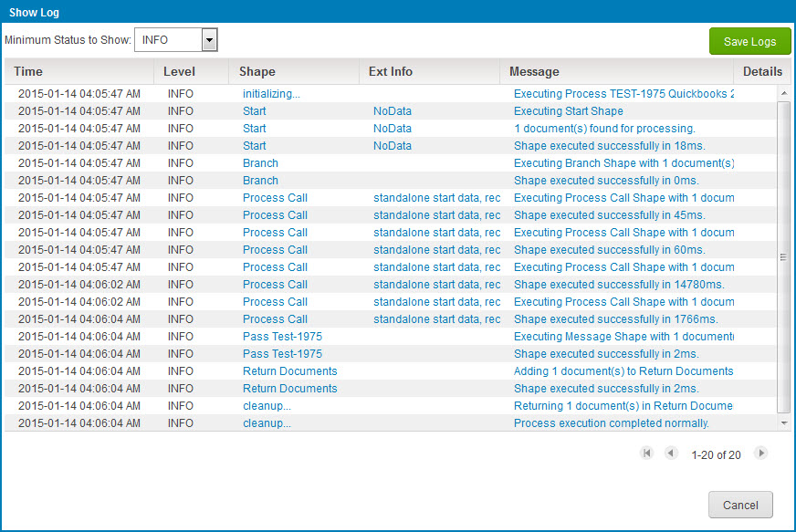

# Viewing a process log 

<head>
  <meta name="guidename" content="Integration"/>
  <meta name="context" content="GUID-cf926bcb-17b1-40e4-8a00-321accf98af4"/>
</head>

You can view a process log in Process Reporting.

## Procedure

1.  Select **Manage** \> **Process Reporting**.

2.  Find the desired process execution result.

3.  Do one of the following:

    -   Click the ** View Process Logs** icon for that execution.

    -   Click the date/time link for that execution to go to its detail view and in the ** Actions** menu, select ** View Process Logs**.

    :::note
    
    - If a process does not execute, because it was discarded or because the user tried to execute it when it was already running, a log is not created. If that is the case, the **View Process Logs** icon is not available. The View Process Logs icon displays only when the process execution is finished.

    - Process log file size is limited to 500MB. If the process log file exceeds the limit, a warning is displayed indicating that the log size is too large to load, and the log must be downloaded to view it.

    :::

    The Show Log dialog opens and the connects to the Atom and retrieves the log's contents. Once retrieved, the logged events are shown in the dialog.

    

4. **Optional:** To download the contents of the log, click **Save Logs**.

    Depending on your browser and its download settings, you may be prompted to specify the destination path and filename. The default filename is process\_log.zip.

5.  To return to the view from which you opened the dialog, click **Cancel**.