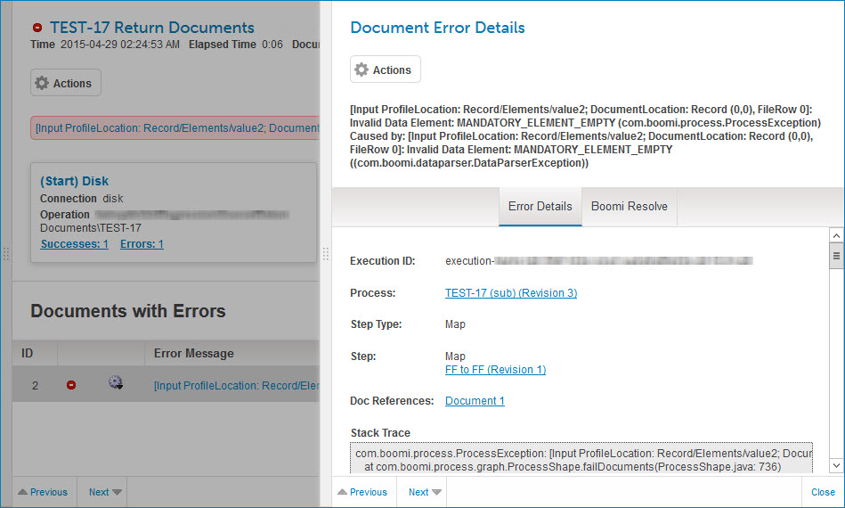

# Viewing document error details 

<head>
  <meta name="guidename" content="Integration"/>
  <meta name="context" content="GUID-edecac3d-8580-4ec6-a175-219803a256e4"/>
</head>

You can view document error details in Process Reporting.

## Before you begin

You must have the View Data privilege to view document error details. If you have only the View Results privilege, you cannot perform the task.

## Procedure

1.  In the **Manage** menu’s **Process Reporting** page, find the execution during which the error occurred.

2.  Click the date/time link for that execution to go to the execution detail view.

    The **Documents with Errors** list contains entries for documents with errors processed during the execution.

3.  Do one of the following:

    -   To view error details for the first document in the **Documents With Errors** list, click the truncated Error Message for the document either in the list or immediately above the connections list.

    -   To view error details for any other document in the **Documents With Errors** list, click the truncated Error Message for the document in the list.

    The Document Error detail view opens. The full error message is shown immediately below the list heading.

    

4.  View the details in the **Error Details** tab. For more information, see the topic about the Document Error detail view linked below.

5. **Optional:** To view possible solutions to the error, including from this documentation and articles in the Boomi Community, use Boomi Resolve:

    1.  Select the **Boomi Resolve** tab.

        As many as 10 solutions are listed in order of relevancy.

        

    2.  To view solution detail and links to articles, click the expand icon adjacent to a solution heading.

        For more information, see the topic about Boomi Resolve linked below.

## Next steps

If you need to submit a support request for help with the error, copy and paste the contents of the **Error Details** tab, including the **Stack Trace**, into the request.