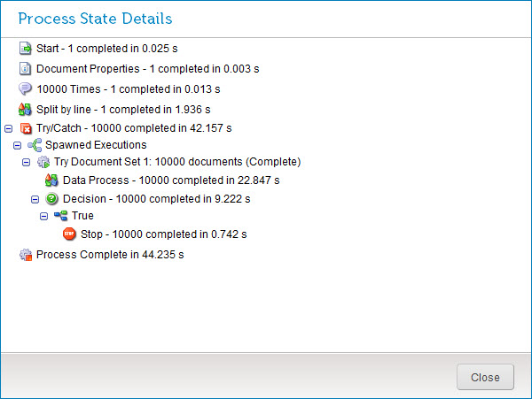

# Viewing process execution steps and durations 

<head>
  <meta name="guidename" content="Integration"/>
  <meta name="context" content="GUID-ef1b4684-2be9-4919-bed7-09b8d7eba992"/>
</head>

View the sequence in which a process’ steps were executed and the time it took to execute each step.

## Procedure

1.  In the **Manage** menu’s **Process Reporting** page, find the desired process execution result.

2.  Do one of the following:

    -   In the ** Actions** menu for that execution, select ** View Process State**.

    -   Click the date/time link for that execution to go to its detail view and in the ** Actions** menu, select ** View Process State**.

    The Process State Details dialog opens.

    

3.  To return to the view from which you opened the dialog, click **Close**.