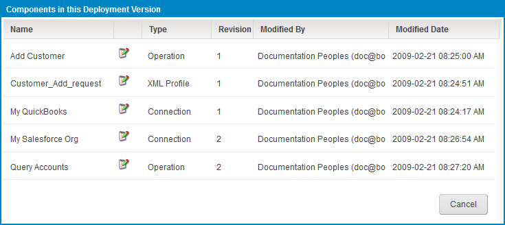

# Viewing the components in a deployed process 

<head>
  <meta name="guidename" content="Integration"/>
  <meta name="context" content="GUID-e7e06881-6201-4aa8-8dd4-1eecdc4b7d54"/>
</head>

Use the Process Reporting page to view components in a deployed version.

## Procedure

1.  In the **Manage** menu’s **Process Reporting** page, find the desired process execution result.

2.  Do one of the following:

    -   In the ** Actions** menu for that execution, select ** View Deployment Components**.

    -   Click the date/time link for that execution to go to its detail view and in the ** Actions** menu, select ** View Deployment Components**.

    The Components in this Deployment Version dialog opens.

    

3.  To return to the view from which you opened the dialog, click **Cancel**.