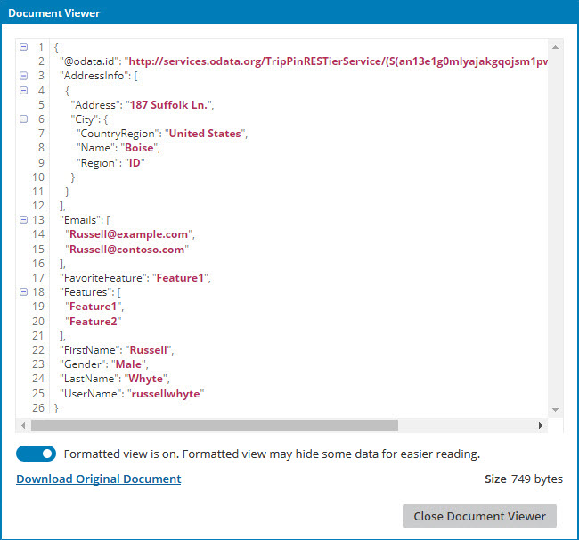
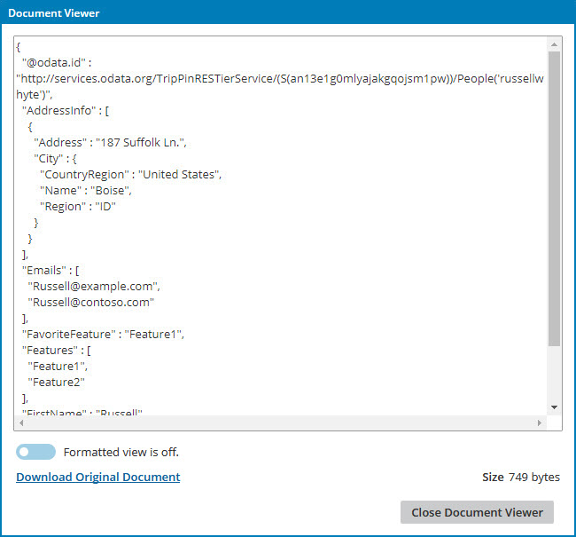

# Viewing the data in a processed document 

<head>
  <meta name="guidename" content="Integration"/>
  <meta name="context" content="GUID-046a8040-390c-45c7-87cf-8c5693999ead"/>
</head>

You can view data in processed documents in Process Reporting.

## Before you begin

You must have the View Data privilege to view the data in a processed document. If you have only the View Results privilege, you cannot perform the task.

## Procedure

1.  Go to the **Manage** menu’s **Process Reporting** page.

2.  Select **Executions** or **Documents** from the list on the left.

3.  Change the search options and filters to locate the execution or document that you need.

4.  In the results table, find the execution or document and click its link in the **Time** column.

5.  Navigate to one of the following locations:

    -   Connection documents list

    -   Documents with Errors list

    -   Document detail view

6.  Click the  **Actions** icon and select  **View Document**.

    The document opens in the Document Viewer dialog.

    

7. **Optional:**  If the document contains XML or JSON data, you can view it unformatted by turning off the Formatted view.

    

8. **Optional:**  If you want to see the entire document, click the **Download Original Document** link to download it.

9.  Click **Close Document Viewer**.