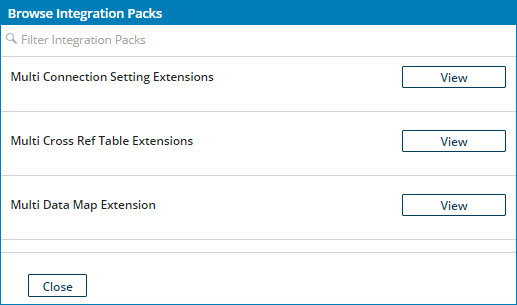

# Browse Integration Packs dialog

<head>
  <meta name="guidename" content="Integration"/>
  <meta name="context" content="GUID-9f881ce7-df46-4e5f-9449-e3a5e90805a6"/>
</head>

On the **Integration Packs** page, you can search for integration packs, view details, and install them in the **Browse Integration Packs** dialog.

Clicking **Browse Integration Packs** \(or  for Legacy deployment\) from the **Integration Packs** page opens the **Browse Integration Packs**dialog. Here you can browse and install integration packs that are available to your account.

Type in the **Filter Integration Packs** field to filter the integration packs list to include only integration packs that have matching names. To clear the field and stop filtering, press the **Esc** key on your keyboard .

The integration packs listed are assigned as resources to account groups of which the account you are using is a member. You can click **View** to look up details about that integration pack.
