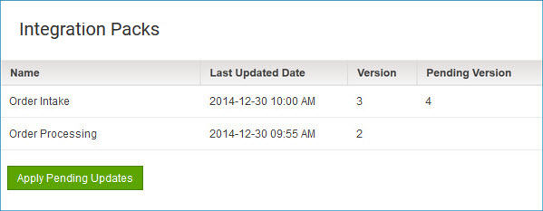

# Integration Packs page \(Legacy, non-environment\)

<head>
  <meta name="guidename" content="Integration"/>
  <meta name="context" content="GUID-b742b4d2-fc36-49a0-98aa-792cd1a6a4c2"/>
</head>

You can add, modify, delete, release, and re-release integration packs on the **Manage** \> **Integration Packs** page.

## Integration Packs 

Lists by name the integration packs that are managed by the account. To change the name or description of an existing integration pack or to modify, release, or re-release it, you must first select the integration pack in this list.

Clicking ** Add Integration Pack** adds a new integration pack.

## Integration Pack Name

Sets the name of a new integration pack or, if a previously added integration pack is selected in the Integration Packs list, updates the name of that integration pack.

## Integration Pack Type

Sets the type of a new integration pack:

- Single Attachment — Only one instance of the integration pack can be installed per account.

- Multiple Attachments — Multiple instances of the integration pack can be installed per account.

You cannot change the type once the integration pack is added.

This list is present only if the multi-install integration packs feature is enabled in the account. If you would like to have this feature enabled, contact your Sales Representative. If this feature is not enabled, you can add only Single Attachment integration packs.

:::info

Multi-install integration packs cannot include API Service components.

:::

## Description

Sets the description of a new integration pack or, if a previously added integration pack is selected in the Integration Packs list, updates the description of that integration pack. The description can contain up to 500 characters.

## Save

Saves changes to the Integration Pack name and description. If the integration pack is new, clicking **Save** adds the integration pack to the Integration Packs list.

## Delete Integration Pack

 Initiates a request to delete the selected integration pack.

In the confirmation dialog:

- Clicking **OK** executes the request.

    Upon deletion, the integration pack is automatically uninstalled from any accounts in which it was installed, and any Atoms or environments that were attached to it are detached.

- Clicking **Cancel** cancels the request.

## Release date

Shows the date on which release of the selected integration pack is scheduled to occur. If the integration pack has previously been released, this is the date on which an update will automatically be applied to accounts in which the integration pack is installed.

## Publications

Lists the published processes and API Service components that are included in the selected integration pack. For each component, the following information is shown:

**Component Name**  
Name of the process or API Service component.

**Component Type**  
Type of component: Process or API Service.

**Current Version**  
If the integration pack is released, the version number of the published component in the release.

**Pending Version**  
If the published component is not in the current release of the integration pack, the version number of the current published component. This is the version that would be included in a new release of the integration pack.

A value of “Deleted” means the component is no longer included in the integration pack and would not be included in a new release.

**Available Version**  
If the current version of the published component is not in the current release of the integration pack, this is the current version number. This is the version that would be included in a new release of the integration pack.

You can perform the following actions on the Publications list:

** Add**  
Opens the Published Components dialog, which is used to add published components to the selected integration pack.

 

  In the dialog:

- The **Filter Components** field is used to filter the list. As you type in this field, the list is filtered to include only components whose names partially or completely match the typed characters.

 To discontinue filtering and restore the unfiltered list, click .

  - Turning on the check box for a component selects it for inclusion in the integration pack.

  - Clicking **OK** adds the selected components and closes the dialog.

- Clicking **Cancel** closes the dialog without adding any components.

** Remove**  
Initiates a request to remove the selected component from the selected integration pack.

In the confirmation dialog:

 - Clicking **OK** executes the request.

 - Clicking **Cancel** cancels the request.

** Release Integration Pack**  
Opens the Integration Pack Release dialog, which is used to release or re-release the integration pack. The new release would include any versions of the components identified in the list as “Pending” or “Available”.

 In the dialog:

 - Clicking **Release Immediate** specifies an immediate release. If this is a re-release, the update would be applied immediately to managed accounts in which the integration pack is installed.

 - Clicking **Release Pending** specifies a pending release. If this is a re-release, users of managed accounts in which the integration pack is installed would have the option to apply the pending update. On the specified **Release Date**, the release control period would end — if the pending update had not yet been applied manually, it would be applied automatically. Clicking the **Release Date** field opens a calendar control for date selection.

  - Clicking **OK** releases the integration pack and closes the dialog.

 - Clicking **Cancel** cancels the request.

:::note

If there are not any versions Pending or Available, the ** Release Integration Pack** icon is disabled.

:::
