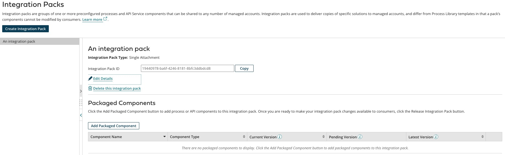

# Integration Packs page

<head>
  <meta name="guidename" content="Integration"/>
  <meta name="context" content="GUID-623dba34-859b-4ad4-ad2c-d22d9503bd5a"/>
</head>

Go to the **Manage** \> **Integration Packs** page to create, modify, delete, release, or re-release integration packs.

On the **Integration Packs** page, details about the first integration pack in the list appear. The list includes all integration packs managed by the account.

:::note

If you did not create integration packs, the Integration Packs landing page appears. The landing page provides tips for getting started with integration pack development.

:::

By default, sorting packaged components are done by component name. You can also sort the list of packaged components by:

- Component name — the title of your process or API Service component

- Component type — process or API Service component

- Version — current, pending, or latest version of the packaged component

**Integration Pack Type**  
The type of integration pack, as one of the following:

 - **Single Attachment** — You can install one instance of the integration pack per account.
 - **Multiple Attachments** — You can install multiple instances of the integration pack per account.

**Integration Pack ID**  
The GUID of the integration pack. You can copy the GUID to help with troubleshooting and for use in the AtomSphere API.

**Component Name**  
The name of the process or API Service component that was packaged.

**Component Type**  
The type of component that was packaged, either **Process** or **API Service Component**.

**Current Version**  
If the integration pack is released, the version of the packaged component that is in the current release.

**Pending Version**  
If the package is not included in the current release of the integration pack, this is the current version of the packaged component.

Provided there is no Latest Version, the pending version will be included in a new release of the integration pack.

A value of "Deleted" means the packaged component version was removed from the integration pack and would not be included in a new release. You can click **Undelete** to restore the deleted package version.

**Latest Version**  
If the current version of the packaged component is not included in the current release of the integration pack, this is the most recent version of the package.

If there is an Available Package Version that is more recent than the current version, that version would be included in a new release of the integration pack.
