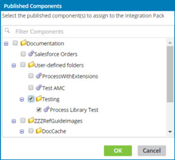

# Adding published components to an integration pack \(Legacy, non-environment\) 

<head>
  <meta name="guidename" content="Integration"/>
  <meta name="context" content="GUID-1bd02f0a-ce17-4e9b-bf26-8bb87ea52cec"/>
</head>

Add published components to an integration pack to make them available for release as part of the integration pack.

1.  In the Integration Packs page, select the integration pack.

2.  In the Publications list, click ** Add**.

    The Published Components dialog opens.

    

3.  To filter the components list, type in the **Filter Components** field.

    As you type, the list below is filtered to include only components whose names partially or completely match the typed characters.

    To discontinue filtering and restore the unfiltered list, click .

4.  Select the check box for each component that you want to add to the selected integration pack. You can add a maximum of 100 components.

5.  Click **OK**.

    The dialog closes, and the newly added components appear in the Publications list.