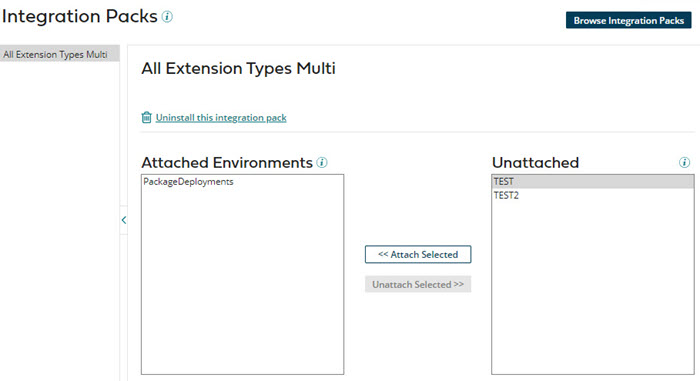

# Attaching or detaching an environment to or from an integration pack 

<head>
  <meta name="guidename" content="Integration"/>
  <meta name="context" content="GUID-945ac79e-202b-4c22-adad-2b32667dc031"/>
</head>

Attach or detach environments to or from an integration pack on the **Integration Packs** page.

## About this task

## Procedure

1.  Access the **Integration Packs** page by doing one of the following:

    -   From the **Deploy** menu, select **Integration Packs**.
    -   (Legacy) On the **Deploy** page, select **Integration Packs** from the components list.
2.  On the **Integration Packs** page, select an integration pack from the list.

3.  To attach an environment(s), select the environment(s) in the **Unattached Environments** list, then click **Attach Selected Environments** to move the environment(s) to the **Attached Environments** list.

4.  To detach an environment(s), select the environment(s) in the **Attached Environments** list, then click **Detach Selected Environments** to move the environment(s) to the **Unattached Environments** list.

## Results

:::note

If you detach and reattach an integration pack to an environment after accepting the pending version, updates made in the pending version are not maintained in the integration pack but rather are applied according to the specified release date.

:::