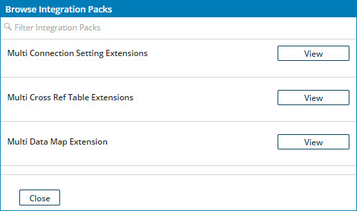

# Installing an integration pack 

<head>
  <meta name="guidename" content="Integration"/>
  <meta name="context" content="GUID-28e77d45-e677-4b37-b592-5c6e7d399133"/>
</head>

Use the Browse Integration Pack dialog on the **Integrations Packs** page to install single or multiple integration packs.

## Procedure

1.  Access the **Integration Packs** page by doing one of the following:

    -   From the **Deploy** menu, select **Integration Packs**.
    -   \(Legacy\) On the **Deploy** page, select **Integration Packs** from the components list.
2.  Click **Browse Integration Packs** \(or  for Legacy deployment\).

    The Browse Integration Packs dialog opens. Integration packs that are assigned to account groups of which the account you are using is a member are listed.

    

3.  Find the integration pack you want to install and do one of the following:

    -   Browse the complete list.

    -   Filter the list by clicking **Filter Integration Packs** and typing in the field. As you type, the list is filtered to include only integration packs whose names match or contain the typed characters.

4.  Click the **View** button for the integration pack you want to install.

    The list is replaced by details about that integration pack and the **Install** button.

    

5.  Click **Install**.

    -   If the integration pack is enabled for a single install per account, it is installed. The integration pack details are replaced by confirmation of installation. Skip to step 8.

        

    -   If the integration pack is enabled for multiple installs per account, the integration pack details are replaced by the **Choose new process name** field — continue with step 6.

        

6. **Optional:** In the **Choose new process name** field, replace the name of the integration pack with a name for the instance of the integration pack to be installed. Pick a name that describes the intended purpose of the instance.

7.  Click **Complete Installation**.

    An instance of the integration pack is installed. The field is replaced by confirmation of installation.

8.  Do one of the following:

    -   To dismiss the dialog, click **Close**.

    -   To view the list of integration packs available for installation, click **Integration Packs**.