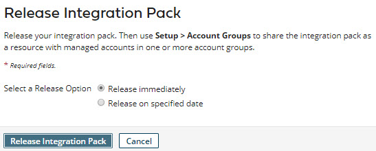

# Releasing an integration pack 

<head>
  <meta name="guidename" content="Integration"/>
  <meta name="context" content="GUID-66a98806-e525-4539-9ffc-b28984163647"/>
</head>

Release an integration pack on the **Integration Packs** page to schedule or push updates to user accounts that subscribe to the integration pack.

## About this task

The steps for re-releasing an integration pack are the same as those for its initial release. In both cases, you first need to add one or more shareable packaged processes or API Service components to the integration pack.

**Note:** For Legacy deployment, an integration pack consists of published processes and API Service components. The UI for releasing integration packs under Legacy deployment varies slightly from this task.

## Procedure

1.  In the Integration Packs page, select the integration pack that you want to release.

2.  Click **Release Integration Pack**. You will not see the **Release Integration Pack** button if your packages within the Integration Pack are already released.

    The Release Integration Pack dialog opens.

    

3.  In **Select a Release Option**, do one of the following:

    -   To specify immediate release, select **Release immediately**.

        If you are re-releasing the integration pack, the update would be applied immediately to managed accounts in which the integration pack is installed.

    -   To specify a future release date, select **Release on specified date**. Then click the **Release on Date** field and select the desired release date in the drop-down calendar.

        If you are re-releasing the integration pack, users of managed accounts in which the integration pack is installed would have the option to apply the pending update. On the specified release date, if the pending update had not yet been applied manually, it would be applied automatically.

4.  Click **Release Integration Pack** \(if you specified immediate release\) or **Schedule Integration Pack Release** \(if you specified a future release date\).

    -   If you specified immediate release, the release occurs. The Packages list updates to reflect the versions of the packaged components in the new release.

    -   If you specified a future release date, the release date appears above the Packages list.