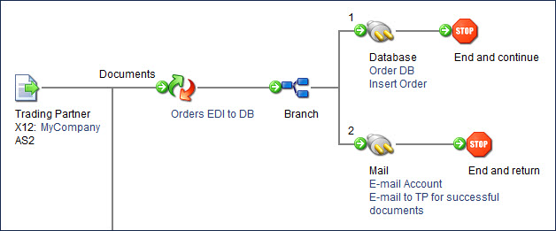

# Branch step example

<head>
  <meta name="guidename" content="Integration"/>
  <meta name="context" content="GUID-b6eb5b29-7a77-4b22-bef2-30d547eb5f5d"/>
</head>

In this example an inbound X12 document is processed through a map and an email message needs to be sent to the trading partner that the file has been processed.

A Branch step needs to be inserted after the map with one branch going to the Database connector and the other branch going to the Mail connector. The document goes down the first branch and after it has been inserted into the database, the email is sent to the trading partner with a message that the document was processed successfully.

