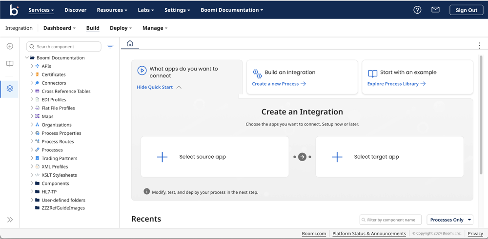

# Build page layout

<head>
  <meta name="guidename" content="Integration"/>
  <meta name="context" content="GUID-e1655cb0-e4da-47cf-bf55-11cc37f0b32f"/>
</head>

The **Build** page is where you create and edit integration processes and components.

The main areas of the **Build** page are:

- Component Explorer — Used to create, copy, delete, show usage of, and organize components in folders.

- **Create New** button — Used to create new components. Search for or select a new component type to create. To help you make a decision, you can hover on a component type to see a short description about its purpose.

- **Recents** section — Use this section to quickly access processes and components recently opened in your account.

- Component tabs — When you open a component, it appears in a tab. You use a component’s tab to view and edit the component.

A process component’s tab contains the process canvas, which you use to configure the process flow.

When the component tabs area is not wide enough to view all open tabs, a drop-down menu labeled **All** appears next to the right-most visible tab. All open tabs are available for selection in the menu. The order of the tabs are from most to least recently opened.

:::note

If you have only Build Read Access privileges, the redesigned Integration **Start** tab provides actions available based on your privileges, such as viewing and clicking items recently opened on the **Start** tab. In addition, the **Create New** button and the **Build a Process** section do not appear.

:::
