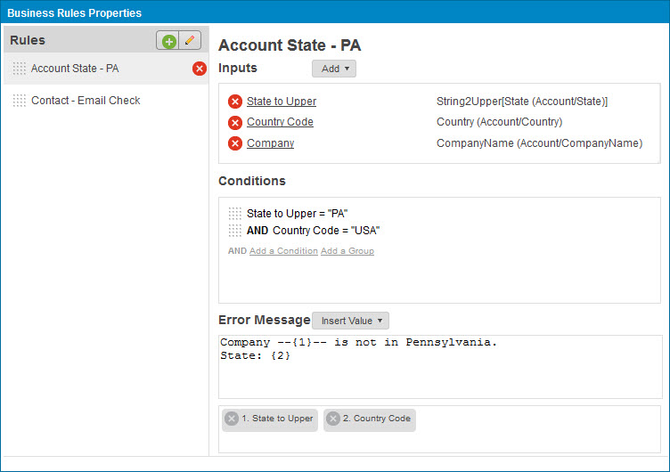
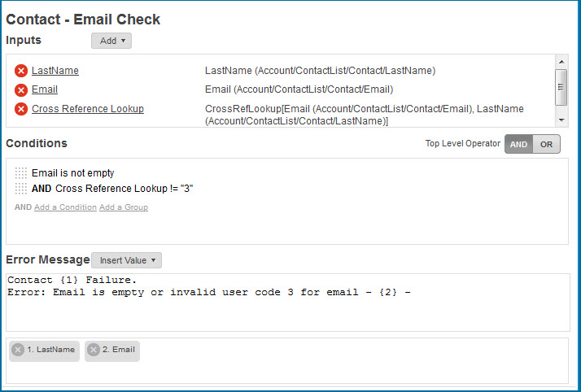
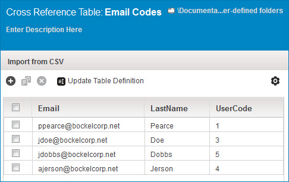
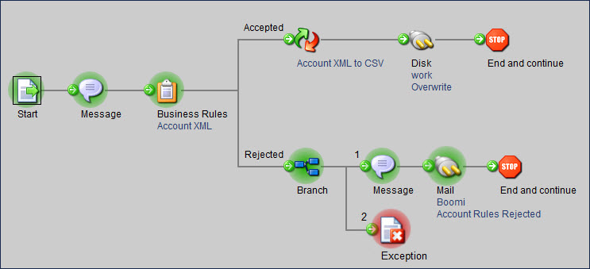
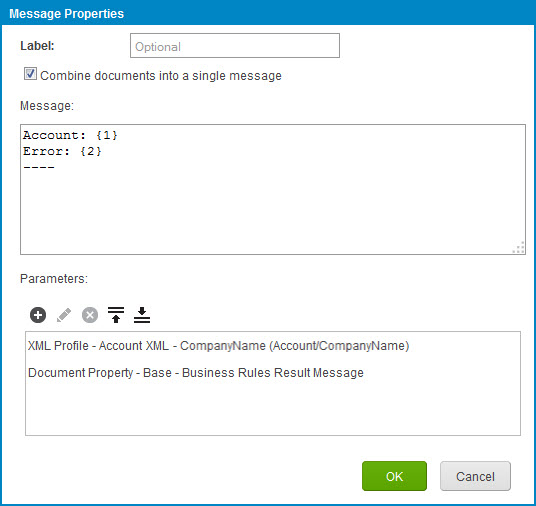
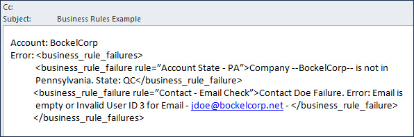

# Business Rules step example

<head>
  <meta name="guidename" content="Integration"/>
  <meta name="context" content="GUID-41f27424-482a-4cb4-b84b-5a9e3dd8ff9e"/>
</head>


In this example an inbound Account XML document contains some company and contact information for an account. The company can have multiple, repeating contacts.

Here is the sample XML input:

```xml
<Account>
<CompanyID>1564862</CompanyID>
<CompanyName>BockelCorp</CompanyName>
<Website>http://bockelcorp.net</Website>
<StreetAddress1>801 Cassatt Road</StreetAddress1>
<StreetAddress2>Suite 120</StreetAddress2>
<City>Montreal</City>
<State>qc</State>
<PostalCode>HEZ 39-542</PostalCode>
<Country>CA</Country>
<Phone>555-854-0700</Phone>
<Industry>Technology</Industry>
<ContactList>
<Contact>
<FirstName>Pamela</FirstName>
<LastName>Pearce</LastName>
<Email>ppearce@bockelcorp.net</Email>
</Contact>
<Contact>
<FirstName>John</FirstName>
<LastName>Doe</LastName>
<Email>jdoe@bockelcorp.net</Email>
</Contact>
</ContactList>
</Account>
```

The process developer wants to validate two business rules in order to successfully accept the document.

Business Rule 1 is named "Account State - PA". It validates that:

1.  The State field in uppercase syntax is equal to "PA".

2.  The Country field is equal to "USA".


Business Rule 1 was set up as follows:

-   The State to Upper alias is a function input that uses the String \> String to Upper function and applies the State field from the XML profile as the original string. The function output in this case is compared to a static value of "PA".

-   The CountryCode is a standard profile input that is compared to a static value of "USA".

-   The Company field input is used purely as an identifier in the error message.




Business Rule 2 is named "Contact - Email Check". It validates that:

1.  The Email field is not blank.

2.  The result of a cross-reference lookup against a set of email user codes does not identify a contact instance as UserCode 3.


Business Rule 2 was set up as follows:

-   The Email field input uses the Is Not Empty operator to ensure that the field is populated.

-   The cross reference table lookup function input accepts the Email field and the LastName field as inputs in order to find the UserCode. The alias was changed to better reflect the result.

-   The cross reference table identifies John Doe as an invalid contact because John has UserCode 3.






This is the result of the process execution.



The Message step captures the source Account XML document and includes the error as an embedded XML message captured from the Business Rules Result Message document property.



This is a sample of the email that would be generated.



Note that the XML content is directly output as a parameter. If you would like to view the result messages in another format, consider doing the following:

-   Add a Message step that captures the Business Rules Result Message document property as a single parameter.

-   Pass the resulting document into a map that converts it from a source profile structure like the sample XML output above \(without the second failure detail\).

-   Translate it to the desired format, such as flat file.

-   If preferred, include it in a new Message step after the map, as a Current Data parameter along with other static or dynamic message details.

-   Turn on the "Combine documents into a single message" check box in the final Message step to aggregate errors across documents.