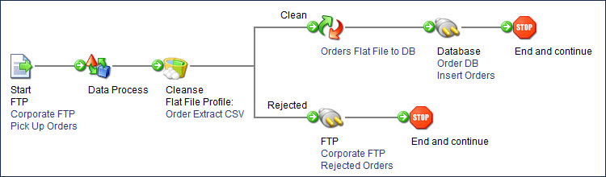

# Cleanse step example

<head>
  <meta name="guidename" content="Integration"/>
  <meta name="context" content="GUID-4c8a0b5f-411c-4fb5-94c7-7c5d79bcccd3"/>
</head>

This is example, a batch CSV file of new orders is being picked up from your company's FTP server. The batch file contains many orders.

A number of restrictions are defined in the flat file profile "Order Extract CSV", including mandatory values, maximum lengths, and numeric and date formats. Properly formatted and populated orders should be inserted into the ordering database for fulfillment, but rejected orders should be sent back to the FTP site to be corrected.

Your process might look like this:

