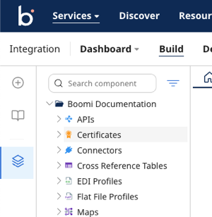

# Working in the Component Explorer

<head>
  <meta name="guidename" content="Integration"/>
  <meta name="context" content="GUID-b293eeb3-9616-4aa0-ba2d-60cf2d1f37fd"/>
</head>

The Component Explorer is located on the left side of the Build page. It serves as a central hub for managing all components in your account. Components are grouped by type for easy navigation.

## Key Features

- Create, edit, copy, move, and delete components.

- View and restore deleted components.

- Search and find components and see where they are used.

- Refresh the Component Explorer to view the latest changes.

- Hide the Component Explorer to expand the process canvas as needed.

## Component Explorer filters and searching

The Component Explorer allows filtering and searching. You can filter by **Deployed Status**, **Where Used**, **Component Type**, or **Deleted Components**. Once you have a filter applied, a search returns only items that meet the filter criteria in the search results.

#### Adding Filters

1. Click the  icon to add a filter.

2. Select the desired filters.

3. If the filter icon is colored , one or more filters are applied.

4. To remove or change filters, click the icon again.

#### Searching Components

- Enter a search term and click **Enter**.

- Search by component name, folder name, or use specific commands:

    - `id:componentId`: Search by component ID. Component IDs are often included in audit log entries and error messages.For example, `id:599cc27e-1f13-4642-9c90-2a76ed486f27`.

    - `deleted:true`: Search for deleted components of any type and within any folder. All categories and folders that contain deleted components, as well as the deleted components themselves, are displayed in the Component Explorer.

## Organizing Components with Folders

Efficient organization improves productivity. Use folders and sub-folders to categorize components based on user accounts, teams, or integration projects.

#### Best Practices for Folder Organization

- Plan Ahead: Outline folder hierarchy based on: common components, frequently used connections, user or team needs.

- Meaningful Names: Use self-describing and consistent naming conventions.

- Avoid Top-Level Folder: Save components in designated sub-folders to avoid clutter. Drag and drop components to move them between folders if necessary.

#### Folder Actions

- **Create**: Add folders and sub-folders as needed.

- **Rename**: Update folder names for clarity.

- **Copy**: Copy folder from the account.

- **Move**: Drag and drop components to new folders.

- **Delete**: Remove unwanted folders (except the top-level folder).

- **Restore**: Recover deleted folders and components.

:::tip

- Regularly refresh the Component Explorer to view updates.

- Use filters and searches together to narrow down results effectively.

- Maintain an organized folder structure for seamless collaboration and component reuse.

:::

