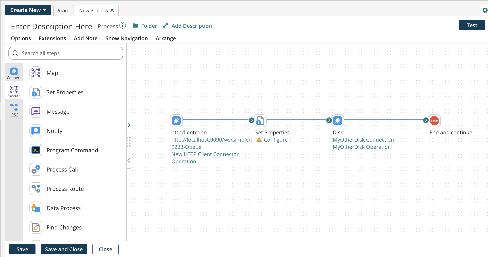
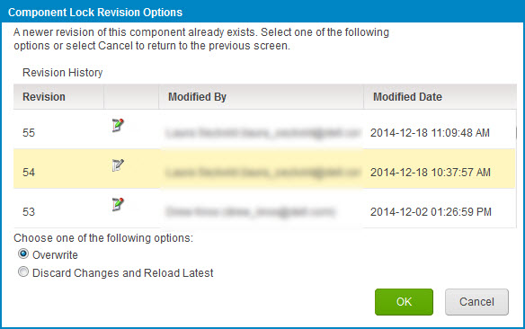
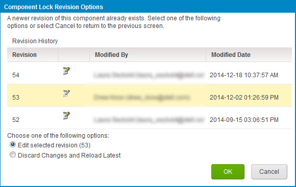

# Component locking

<head>
  <meta name="guidename" content="Integration"/>
  <meta name="context" content="GUID-A321E79A-720F-4665-B27C-B8A4EF117E8B"/>
</head>

While component locking is turned on in your account and one user locks a component, another user cannot edit it unless they have the Administrator role.

:::note

Component locking is available to all accounts, but is not turned on by default. Account administrators can self-enable this option for their accounts by toggling the ON/OFF button, then refreshing the page to see the changes.

:::

If you work for a large company or enterprise with many users, you may have encountered the problem whereby more than one user inadvertently opens and edits the same component at the same time. Because each user does not realize that the other is editing the component, they make their changes independently. The end result is that whichever user saves the component last “wins” and retains his changes. Changes made by the other user are lost because they are overwritten.

With component locking turned on in your account this cannot occur. Every time a user opens any type of component it opens on the Build page with a yellow banner indicating that it is in read-only mode.

To ensure that you and no one else can edit the component at that time, you must click Lock & Edit. If another user opens the component while you have it locked and attempts to lock and edit it, one of the following occurs:

-   If the user does not have the Administrator role, a message shows, indicating that you have the component locked. The user can view the component in read-only mode but cannot save changes to it until you have saved and closed the component, which releases the lock.

-   If the user has the Administrator role, a message shows, indicating that you have the component locked. The user can acquire the lock from you to get access to change and save the component or can click Cancel and view the component in read-only mode. An administrator can acquire a locked component from another administrator.

:::note

The component locking feature does not allow you to permanently lock a component. If you open a component and lock it for editing, it remains locked until you save and close it or until your session expires \(you lose Internet connectivity\). If a user accidentally leaves a component locked, an administrator can acquire the lock on the component so that other users can edit it. If you accidentally exit the platform without saving a component that you were editing, you can log in again and attempt to lock and edit the component by acquiring the lock from your previous session.

:::

Integration warns users if they try to save or lock an outdated revision of a component. The Component Lock Revision Options dialog opens. This dialog is similar to the Revision History dialog. It displays all revisions of the component. The revision that you have open is highlighted in yellow. Depending on your current situation, different options are available.

Scenario A: You open revision 1 of a component, *lock it* and start to edit. Meanwhile an administrator acquires the lock, edits and saves it as revision 2. When you try to save revision 1 the dialog below opens. You have the following options:

-   Overwrite — Your changes are saved as revision 3. Revision 3 does not contain the changes that the administrator saved in revision 2.

-   Discard Changes and Reload Latest — Any changes that you made to revision 1 and did not save are lost. Revision 2 opens. If you edit and save the component, your changes are saved as revision 3. Revision 3 contains the administrator’s changes from revision 2 if you did not intentionally change or delete them.

Scenario B: You open revision 1 of a component. You *do not* lock it. Meanwhile another user opens the component, locks, edits and saves it as revision 2. When you try to lock and edit the component, the dialog below opens. Revision 1 is selected. You have the following options:

-   Edit Selected Revision \(1\) — Revision 1 remains open. It does not contain the changes that the other user saved in revision 2. You can edit revision 1. If you edit and save the component, you see the Overwrite option. If you select Overwrite, your changes are saved as revision 3. Revision 3 does not contain the other user’s changes from revision 2.

-   Discard Changes and Reload Latest — Any changes that you made to revision 1 and did not save is lost. Revision 2 opens, containing the other user’s changes. You can edit revision 2. If you edit and save the component, you see the Overwrite option. If you select Overwrite, your changes are saved as revision 3. Revision 3 contains the other user’s changes from revision 2 if you did not intentionally change or delete them.

