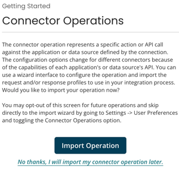

# Connector Operation components

<head>
  <meta name="guidename" content="Integration"/>
  <meta name="context" content="GUID-3B082A92-8675-4890-B086-A1ED95803184"/>
</head>

The operation represents a specific action or API call against the application or data source defined by the connection. For example, in the operation you define which web service call to make \(e.g., Get Purchase Orders, Update Account\), the FTP directory and file filter to get, how to batch commit database inserts, which email addresses to send to, etc.

The configuration options change for different connectors because of the capabilities of each application's or data source's API. Most application operations provide a simple interface to configure the operation and import the request and/or response profiles to use in the process to map to/from, etc. When available, always use the **Import Operation** button to configure the operation.

Operations for application connectors are typically configured with filters or other selection criteria to limit the results returned. These filters are usually supplied with a value passed in from the process step that is calling the operation, such as a Connector step or other step. It is critical to understand how operation filters work and how dynamic values are passed into them.

When creating a new SDK connector operation that supports browse, a Getting Started screen appears to jump start the import operations process. The display of this screen in future sessions can be controlled by a user preference toggle switch in the [**Settings** \> **Preferences**](/Atomsphere/Platform/atm-Preferences_8755af68-ec6f-4f6d-8c03-416e654cf479.md) page of the platform.

