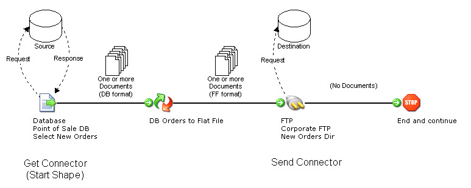

# Connector actions: Get versus Send

<head>
  <meta name="guidename" content="Integration"/>
  <meta name="context" content="GUID-0ce9d9a7-9b6d-4c92-8999-da96c897d71b"/>
</head>

Connectors perform two generic actions — Get and Send — which you specify when configuring a connector step in a process. The connector step references an operation component of the same action type. The action affects how data is processed and filters the list of operations.

The basic difference between Get and Send actions is:

-   Get — The connector retrieves data from a given source and returns it to the process for further processing. This is the only "Get" connector whose documents are logged as inbound data on the Process Reporting page. Documents retrieved by "Get" connectors used mid-process or within another process step \(as a look-up, for example\), are not logged.

-   Send — The connector sends data to a given destination but *does not return any data to the process for further processing*. Documents sent via connector steps in the process are logged as outbound data on the Process Reporting page.

Some connectors support only the Get action. These connector calls consist of a request message and a response message. When getting data \(usually in the Start step\), the request message does not contain a payload body, but will typically contain the selection criteria. The response message contains the resulting data records. When sending data, the request message contains the data records to insert or update and the response message typically contains the resulting transaction status \(success or failure\) along with any error messages.

:::note

The specific *API action* is determined by the underlying operation.

:::