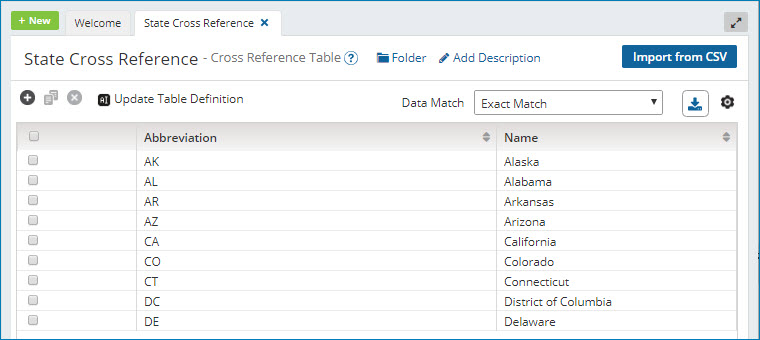
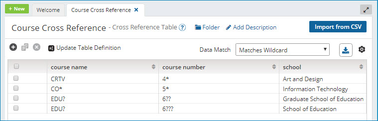

# Cross Reference Table components

<head>
  <meta name="guidename" content="Integration"/>
  <meta name="context" content="GUID-3A5CF906-5A9F-45EE-B73C-8104AF554FF1"/>
</head>

The cross reference table is a data structure that replaces a run-time lookup computation with a much simpler lookup operation. The gain in processing speed can be significant because retrieving a value from memory is much faster than performing a database or other connector lookup.

Cross reference table lookups are most often performed in map functions \(under the Lookup category\) but can also be used as parameter values in all process steps that use parameters, such as connectors \(including the Start step\), Decision, Set Properties, Message, Program Command, and Exception steps.

Some common uses of a cross reference table are:

-   A simple value translation between System A and System B, such as item codes, units of measure, status codes, or any other type of code

-   Reusable translations \(for example, U.S. state abbreviations\)

-   Switch/case logic \(simple if/else\)

-   Atom-specific map default values

-   Atom-specific connection default values \(Start step criteria\)

-   To parameterize any process step with Atom-specific values for deployment to multiple locations or customers

The cross reference table is easy to use and requires no coding. It is comprised of a set of data elements \(or values\) that are organized using a model of rows and columns.

The cross reference table allows you to retrieve a single row of "values" based upon the value of one or more "lookup references". However,  within the Cross Reference Table component configuration, you do not designate the lookup reference\(s\) or value\(s\). These are chosen when you reference the cross reference table within a map function or other step parameter. This allows the same column\(s\) to operate as either the lookup reference or the value, depending on the context.

For example, you are syncing customer address information between two applications. Application A requires the state to be a two-character abbreviation and Application B requires the full name of the state. Because this translation is static and cannot be determined programmatically, you would use a cross reference table with two columns: Abbreviation and Name. When mapping the data from Application A to Application B, "Abbreviation" would be the lookup reference and "Name" would be the output value. When mapping the data from Application B to Application A, "Name" would be the lookup reference and "Abbreviation" would be the output value.

You can use the **Data Match** drop-down list to select a comparison operator: Exact Match, Matches Wildcard, or Matches Regular Expression. Use Matches Wildcard for simple pattern matching. For more complex pattern matching, use Matches Regular Expression.

The following table is an example of using wildcards to define values. In the event that more than one row matches the given lookup reference values, the first match is returned. If no match is found, a null value is returned. Because cross reference tables are read from top to bottom and only the first match is returned, it is important to:

-   Plan your use of wildcards or regular expression syntax carefully.

-   Add rows to the cross reference table in the order in which you want them to be evaluated.

Sometimes a combination of values is necessary to determine the desired output. In these cases, you can choose multiple lookup reference columns and the unique combination of them will return the single output value.

If you are familiar with writing SQL queries, you can think of the cross reference table functionality as a simple SELECT query with one or more columns returned and one or more WHERE clauses: `SELECT *Reference 2* FROM Cross_Reference_Table WHERE *Reference 1* = <Input Value>`

:::note

You can define extensions for cross reference tables referenced in a process to enable modified versions of the cross-reference tables to be used when the process is deployed. Refer to [Process Extensions](../Process%20building/c-atm-Process_extensions_75b3842c-67d8-4baa-9884-1e62e829052a.md) for more information.

:::