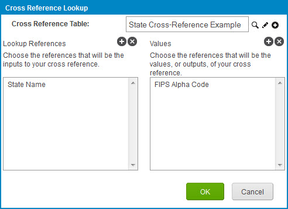

# Cross reference table example: One input and one output

<head>
  <meta name="guidename" content="Integration"/>
  <meta name="context" content="GUID-91e17bc7-36d6-4d79-8c40-a393b12299f0"/>
</head>

A cross reference table can be used to accept one input value and produce one output value. The example here shows a cross reference table lookup within a function.

In addition to setting up the function, you need to map all input elements from the source profile to the input values in the function. You also need to map all output values from the function to the output elements in the destination profile.

For example, when referring to the U.S. states:

-   System A uses the State Name value

-   System B uses the FIPS Alpha Code value

When mapping from System A to System B, you need to translate the State Name value to the FIPS Alpha Code value. The SQL Select statement for the Output\_Element would be: SELECT FIPS\_Alpha\_Code FROM State\_Cross-Reference\_Example WHERE State\_Name = Input\_Element. If the State Name=Alabama in System A then the FIPS Alpha Code=AL for System B. "AL" is the value that will be returned in the output.