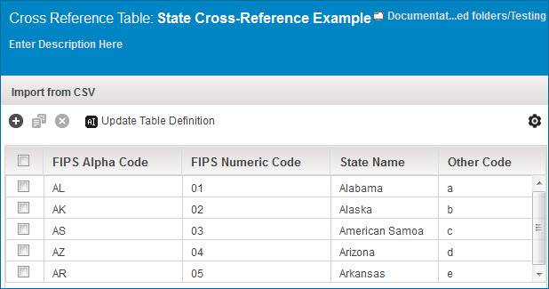

# Cross reference table example: Reusable translations

<head>
  <meta name="guidename" content="Integration"/>
  <meta name="context" content="GUID-2f7099ac-933b-4471-b34a-71c8eca432d1"/>
</head>

The cross reference table shown here is an example of reusable translations. The information contained in the table pertains to the U.S. state abbreviations and other types of state codes.

