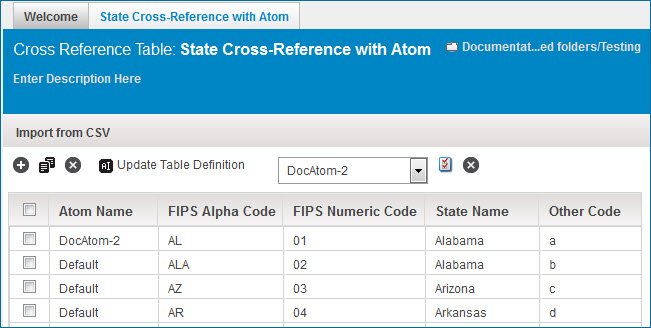

# Cross reference table example: Using Atom values

<head>
  <meta name="guidename" content="Integration"/>
  <meta name="context" content="GUID-082d955d-6854-4c8e-8e2f-16700979fa87"/>
</head>

In this example the cross reference table's first row uses values that come from an Atom.

For example, when referring to the U.S. states:

-   System A uses the State Name value

-   System B uses the FIPS Alpha Code value

When mapping from System A to System B, you need to translate the State Name value to the FIPS Alpha Code value. The SQL Select statement for the Atom-specific Output\_Element would be: `SELECT FIPS_Alpha_Code FROM Cross_Reference_Table WHERE State_Name=Input_Element AND Atom=<Atom Name> Atom=<Default>`.

If the State Name=Alabama in System A and the Atom Name=DocAtom-2, then the FIPS Alpha Code=AL for System B. "AL" is the value that is returned in the output.

If the State Name=Alabama in System A and the Atom Name=Default, then the FIPS Alpha Code=ALA for System B. "ALA" is the value that is returned in the output.