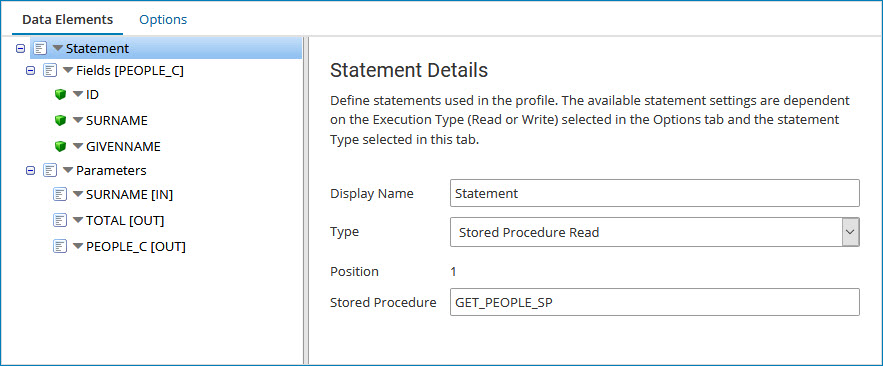
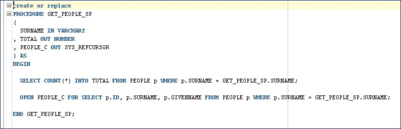

# Database (Legacy) profiles

<head>
  <meta name="guidename" content="Integration"/>
  <meta name="context" content="GUID-2ab15909-008d-48ce-a514-3d7ccbf660f7"/>
</head>

:::note

The Database (Legacy) Profile and Database (Legacy) connector are no longer actively maintained. We encourage you to migrate to the updated [Database V2 connector](../Connectors/int-Database_V2_connector_7b04dbdd-ef36-4a2f-b6ff-b038b3f60ff2.mdx).

:::

Database profiles represent the data set to be retrieved from or written to a relational database. Data sets contain the SQL code used to select, insert, update, or delete records. A given profile is paired with a specific database connector operation.

There are two types of database profiles:

- *Read profiles* are used to extract records from a database. Read profiles contain one or more SELECT statements \(and/or stored procedure calls\) and the fields \(or elements\) returned in the result set\(s\). In a map, the Read profile is referenced as the source profile.

- *Write profiles* are used to write records to a database. Write profiles contain one or more INSERT/UPDATE/DELETE statements \(and/or stored procedure calls\) and the input fields for those statements. In a map, the Write profile is referenced as the destination profile. You can define multiple statements to insert or update parent-child relationships in one map.

The following standard data type elements are supported by the database profile, including for result sets: Character, Number, Date/Time, Clob, and Blob. Local database driver-specific data types are not supported, except for Oracle REF CURSOR types, as noted below.

When extracting data from a database, you can use only a single query. However, that query can join multiple tables and perform other filtering logic.

Here are some suggestions for integrating databases:

- Refer to the documentation provided by your database vendor for syntax details as SQL syntax differs between database vendors. For example, Oracle's SQL syntax is slightly different from Microsoft SQL Server's syntax. Your SQL statements will be parsed by the database you are connecting to.

- Understand table schemas, relationships, and key fields.

- Develop and test queries using a SQL tool like Query Analyzer or [SQuirreL](http://squirrel-sql.sourceforge.net/). These tools give fast and easily readable results.

## Dynamic Insert, Update, and Delete statements

A Dynamic Insert statement type enables you to define the table and fields to insert into. To do that insertion, field names must directly match database table field names, but they can be listed in any order. The insert statement is dynamically generated based on these settings and on the data that is *mapped* into each of the fields. If there is no source data to send into a particular field, that field definition and value are not included in the insert statement. Setting a default value for an element in the map is handy if a required field is blank.

A Dynamic Update statement type works similarly to the Dynamic Insert statement. You specify the table name and fields to be included in the update statement. If a particular field is not mapped or is blank, the field will not be added to the final updated SQL. The Update type differs in that it uses *conditions*, which are the WHERE clause parameters you set to make the update unique. For example, to dynamically update a Contact record, set a primary field as the condition, such as Email or Last Name, so the data set targets that Contact record specifically. Mapping the Email field from the source data ensures this unique update statement will be generated.

A Dynamic Delete statement type allows you to delete entire record instances based on one or more conditions. These are the WHERE clause parameters you set to make the delete unique. For example, to dynamically delete a Company record, set a primary field such as CompanyID or CompanyName as the condition so the data set targets that Company record specifically. Mapping the ID from the source data ensures a unique delete statement will be generated.

:::note

If you use the Import Wizard to generate the Dynamic Update and Dynamic Delete, every field is added as a unique condition. You *must* manually delete all condition instances that should not be a part of the WHERE clause or will expect data to populate each condition.

:::

## Multiple database profile statements

You can specify multiple statements in one database profile. This is useful when inserting into tables that have parent-child relationships. For example, one statement can insert into the OrderHeader table and another statement can insert into the OrderDetail tables. In the profile component configuration dialog you can optionally set unique display names for statements to more easily distinguish between them.

:::note

Refer to [Database Operation](../Connectors/r-atm-Database_operation_a66d6242-d23f-461e-af4a-883efabc08d4.md) to learn more about the commit options for this case.

:::

## Stored procedures and Oracle REF CURSORs

When you define a database profile, you can import the data fields based on a database table or on a stored procedure. Using a stored procedure is handy when you do not have direct access to database tables. The Database Profile Import Wizard supports stored procedures and saves time by pre-populating the field structure based on available metadata.

In stored procedure Read profiles:

- Specify the direction for each parameter as input, output, input/output, or return.

  - Input and input/output parameters can support only one value \(simple\).

  - Output parameters can support one value or multiple values \(simple or complex\).

  - Return values can be simple or complex. One return parameter can be defined per statement and should be the first parameter in the list.

- Optionally specify the data type if the parameter is simple. You cannot specify the data type for complex parameters.

- Optionally specify multiple result sets \(called Fields\).

- Optionally reorder Fields within a statement by dragging and dropping them above the statement’s parameters. You can link Fields to an output or return parameter.

  - If a result set is associated with a parameter whose type is “Value” \(simple\), then only a single field can be added to the result set. The field’s data type is inherited from the output parameter.

  - If a result set is associated with a parameter whose type is “Cursor” \(complex\), then multiple fields can be added to the result set. You can set different data types for these fields.

- Optionally specify REF CURSORS as output parameters from an Oracle database. The database profile supports Oracle REF CURSOR types \(OracleTypes.CURSOR\), which allow a subset of records to be returned from stored procedures and functions. See the example below.

:::note

To use these features with database profiles created prior to May 2014, open and save the profile. This saves the profile in the new format even if you do not edit it. If you do not need these features, simply continue using the database profiles in your processes. Process executions and connectors support both formats.

:::

In the following example, a Stored Procedure Read profile uses an Oracle REF CURSOR. The profile is used to query the People table to find the total number of people with the surname that is submitted as input. The profile then opens a cursor that can be used to access those people and returns both the count and the cursor to the caller.

- The result set “Fields” contains three fields: ID, SURNAME, and GIVENNAME.

- The result set is linked to the PEOPLE\_C output parameter, which is a REF CURSOR.

- The other parameters are SURNAME \(input\) and TOTAL \(output\).

:::note

Due to the behavior of the Oracle JDBC driver, CLOB datatype parameters are not imported as CLOBs for stored procedures, functions, and packages, but rather as characters. After you import a stored procedure, function, or package with CLOB parameters, manually update the **Data Type** in the profile for each such parameter from Character to Clob.

:::
