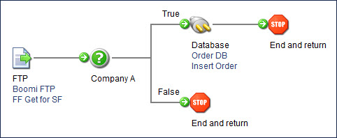

# Decision step example

<head>
  <meta name="guidename" content="Integration"/>
  <meta name="context" content="GUID-d8017cac-48ed-4f66-9efc-b05d6ffff06d"/>
</head>

In this example, a process is able to receive orders only from a specific company, Company A. The Decision step determines whether the document was sent by Company A. If this is true, then the data from the company can continue processing. If this is false, then the document goes to a Stop step and halts processing for that particular instance.

