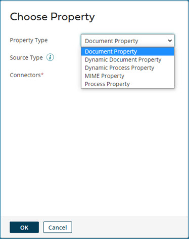

# Document properties

<head>
  <meta name="guidename" content="Integration"/>
  <meta name="context" content="GUID-8d6971ff-fcda-49ff-8c3d-e6a5c716c329"/>
</head>

Send metadata with a document as it progresses through various process steps.

Document properties are additional information or metadata that travels with an individual document as it executes through a process, even as the document data itself is manipulated through Map steps or outbound connector calls. The values contained in properties are separate from the document's actual data contents.

Document property types

There are two types of document properties:

-   Standard document properties \(called simply document properties\) — Contain run-time specific information such as connector or trading partner details.

-   Dynamic document properties — Arbitrary values that you can use to temporarily store related values.

:::note 
Use the **Source Type** drop-down list to select the source for which you are defining document properties. Based on your choice, you then select a specific connector and/or properties.

:::

Setting and retrieving document properties

Document properties can be set in:

-   The Set Properties step

-   The Set Document Property map function

-   A custom scripting step

-   XSLT Transformation step

Document properties can be retrieved from:

-   The parameter value list for most process steps

-   The Get Document Property map function

-   A custom scripting step

-   XSLT Transformation step