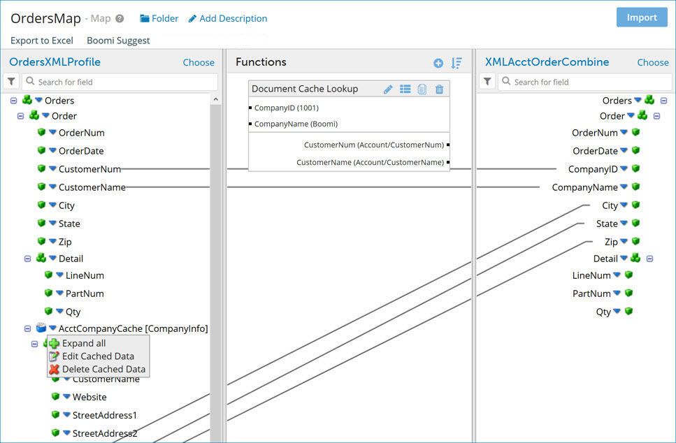

# Document cache lookup in maps

<head>
  <meta name="guidename" content="Integration"/>
  <meta name="context" content="GUID-f1f76d8d-4349-4153-8efe-bc2b7cf1974f"/>
</head>

When you are converting data from one layout or format to another in a map, you may need to combine documents from different sources. To do this you can add documents from a document cache.

After you select a source profile in the map, you can add one or more document caches to it. Document caches can be added to any element in the source profile. For each document cache that you add, you must select one of its indexes. Each key in the document cache's index must be mapped to an element in the source profile.

This in effect allows you to include multiple source documents in a single map. Once you have added the document cache\(s\) to the source profile, you can map elements from the document cache\(s\) and source profile to the destination profile's elements.

When the map that uses the document cache\(s\) is used in a process or sub-process:

-   The elements' values are extracted from the documents in the document cache by using the index and by finding values for the profile elements linked to the keys in the Add Cached Data dialog.

-   If you have more than one key in an index it finds values for all of the keys.

-   If the provided keys from the source profile are null or empty, no matching documents will be found.

-   If multiple records are retrieved with the same key you will get multiple documents.

