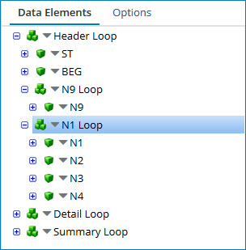
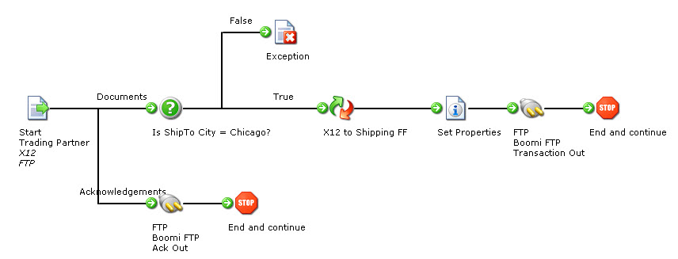
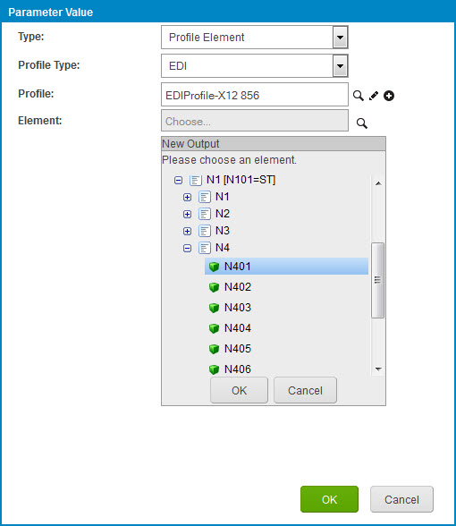
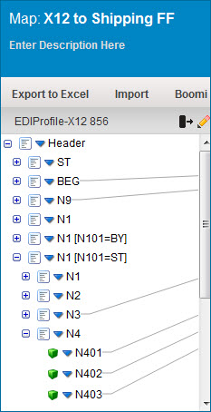

# EDI profile instance identifiers

<head>
  <meta name="guidename" content="Integration"/>
  <meta name="context" content="GUID-99b6337d-c6b6-4d0e-81f9-1ac041f86988"/>
</head>


Instance identifiers are placeholders in an EDI profile that identify specific data sets.

At the loop and segment level, they categorize these data sets based on the numeric occurrence \(for example, the first loop or segment\) and/or qualifier value within a given transaction.

In the following example a purchase order's shipping information is contained in the N1 through N4 segments. The address information is included in a repeating data set \(loop\) for Ship From \(SF\) and Ship To \(ST\) types, so you can identify this information as one loop in the EDI profile.

```
ST*850*0001~
BEG**161905A*0032080731**~
N9*CR*01~
N1*SF*BOOMI HQ~
N3*801 CASSATT ROAD*SUITE 120~
N4*BERWYN*PA*19132~
N1*ST*FOOD STORES~
N3*123 SOUTH STREET~
N4*CHICAGO*IL*84593~
...
```



To identify each loop instance as unique in your integration, you must:

-   Add qualifiers to the N101 data element

-   Add a unique instance identifier at the loop level \(N1 Loop\) for each qualifier


An EDI profile can have a maximum of 200 instance identifiers.

In EDI profiles, instance identifers can be nested. For example, consider a loop, `assembly`, for which there are instance identifiers; `assembly` has a child loop, `part`. If you define an instance identifier for `part`, the same child instance identifiers would be automatically added to each of the `assembly` instance identifiers. All of these instance identifiers, including those automatically added, would count toward the limit of 200.

## EDI instance identifiers and profile lookups

Profile element references and choosers are used throughout the platform to select a specific data element within a profile. With the usage of instance identifiers in EDI profiles, it may be necessary for a specific instance of a particular data element to be selected. In the example below the process is performing a lookup against the data to see if the "Ship To" City = Chicago.



In a standard EDI profile, there is no way to identify the "ST" data without adding and referencing an instance identifier. The example below shows how you can configure a profile element lookup in the Decision step to fulfill the requirements of the process scenario.



## EDI instance identifiers and mapping

Instance identifiers in a map are useful, so you can map specific data values for an occurrence or qualifier. The map example below demonstrates a case where the user wants to map only the “Ship To” data from the EDI source file to build the destination output.

