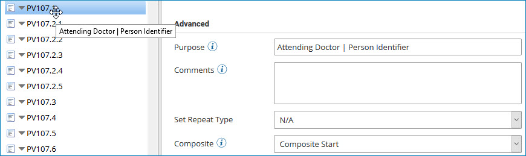

# EDI profile segments and data elements

<head>
  <meta name="guidename" content="Integration"/>
  <meta name="context" content="GUID-8e3ae6b7-757f-4dcd-9f48-cebed4857691"/>
</head>

EDI documents contain rows of data, called segments, which contain information or data elements defined for the segment.

The interpretation of each segment and its contained data is defined by a specification document typically supplied by the trading partner. Entities may alter or add a segment or the data elements contained within it. For user-defined EDI definitions, segment and data element information is created entirely by the business specification developed by the EDI professional.

EDI segments contain header, detail, or summary loop sections. For example, a purchase order document may contain buyer and seller information, shipping addresses, requested delivery dates and times, and special instructions in the header segments. Specifics about product orders, quantities, packaging information, and pricing information may be stored in the detail segments. The summary may contain the total charges for all line items ordered, total weight for the shipment, and total number of pieces ordered.

:::note

The order in which segments are defined is important. The order must match exactly the order in the source document. The same segment name can occur in both the header and detail containers \(such as the N9 segment in many X12 sets\). Incorrectly ordered segments can cause the map to associate a particular segment with the wrong loop section.

:::

## EDI profile elements, composites, and sub-composites

EDI segments contain data elements. Data elements may have one or more components \(called *composites*\). Components can be composed of one or more sub-components \(called *sub-composites*\). If a data element has composites or sub-composites, you can display and use them. Composites and sub-composites may or may not be of the same data type as the data element. When you use this EDI profile, you can map to and from elements that are composites or sub-composites.

A composite's name contains the data element name, a decimal point, and the composite name \(a number\). A sub-composite's name contains the data elements name, a decimal point, the composite name \(a number\), a decimal point, and the sub-composite name \(a number\). The number after each decimal point corresponds to the position of the composite within the data element or the position of the sub-composite within the composite.

Consider a data element named PV107, which has composites and sub-composites:

-   The first composite is PV107.1, which appears in the tree. Pausing on the composite's name in the tree shows the contents of the **Purpose** field \(Attending Doctor \| Person Identifier\) from the EDI Element Details panel. Because the composite is the first in PV107, the **Composite** field in the panel is set to Composite Start.

    

-   PV107's second composite \(PV107.2\) has sub-composites. The first sub-composite is named PV107.2.1. Pausing on the sub-composite's name in the tree shows the contents of the **Purpose** field \(Attending Doctor \| Family Name \| Surname\) from the EDI Element Details panel. Because the sub-composite is the first in PV107.2, the **Composite** field in the panel is set to Sub-Composite Start.

    

In the case of a first sub-composite that is also the data element’s first composite, the **Composite** field in the EDI Element Details panel would be set to Sub-Composite Start \(Data Element\).