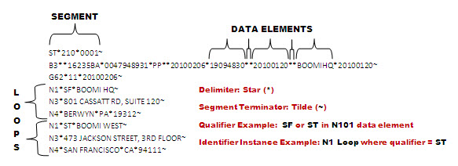

# EDI profiles

<head>
  <meta name="guidename" content="Integration"/>
  <meta name="context" content="GUID-c7e8fbce-80d1-4556-9dc4-ccee215a63aa"/>
</head>

EDI profiles represent the structure of the various EDI documents sent through processes, including all the segments, data elements, looping, and other configuration information.

EDI uses structured document formatting through which developers build solutions following the specifications provided by the company or trading partner. Typically, EDI is independent of a company's internal application systems. EDI formats consist of interrelated document components. The core components are listed below:

-   Segment — Business document data logically grouped with one or more data elements.

-   Data Element — Basic units of information containing a set of values that represent a singular fact.

-   Delimiter — Unique character that separates individual data elements.

-   Segment Terminator — Unique character that identifies the end of a segment string.

-   Qualifier — Specific value of a data element that can be predefined to classify key data.

-   Loop — A section or group of segments that can repeat within one document instance.

-   Instance Identifier — A flag in the EDI structure that identifies a specific data set based on numeric occurrence, qualifier, or both.

Similar to the XML profile, the EDI profile allows you to configure repeating data sets \(loops\). You can also organize segments in Header, Detail, and Summary loop sections.

:::note

The EDI profile is included in its own edition. To have EDI, B2B, and Trading Partner capabilities enabled in your account, contact your representative.

:::