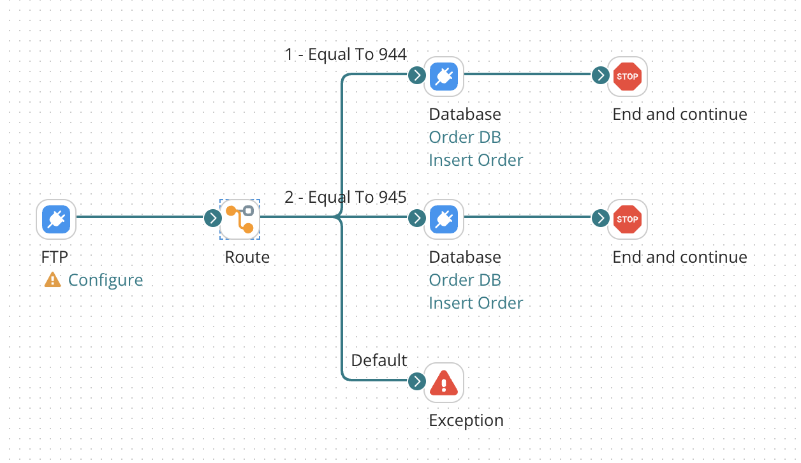

# Exception step example

<head>
  <meta name="guidename" content="Integration"/>
  <meta name="context" content="GUID-98f89744-7afb-4111-a451-f7a3792885ac"/>
</head>

In this scenario, a document is routed according to a specified element in a flat file profile. If the inbound document does not meet the requirement set in the Route step then the document can be routed to a Exception step with an error message.

For example, the Route step checks for inbound 944 and 945 documents. A 940 document comes in. The 940 document will be directed to the Exception step with the following error message: "The document does not meet the requirements set in the Route step. Please review the inbound data." This can help you to troubleshoot an issue because the error is captured in the Exception step with a very specific error message.

